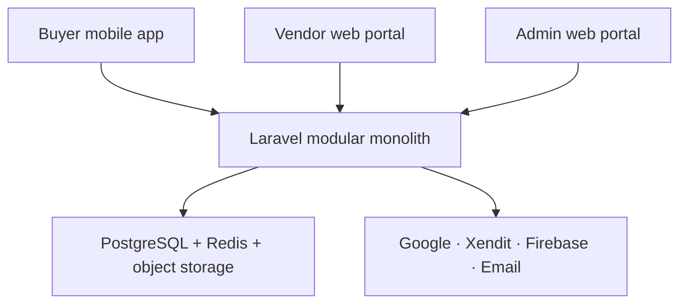
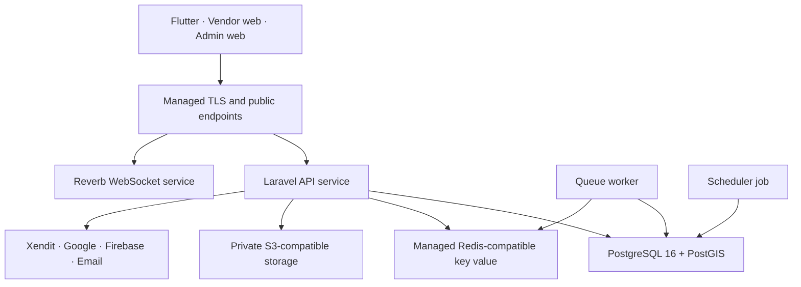
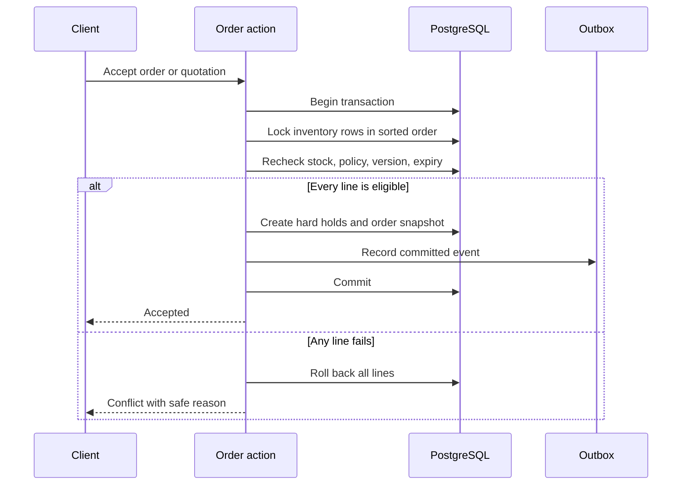

# MateryalPH Technical System Design

**Status:** Approved implementation baseline  
**Design date:** 4 September 2026; tax and Materials Analytics baseline updated 6 September 2026  
**Canonical timezone:** Asia/Manila for business deadlines; UTC for stored timestamps  
**Architecture:** Modular monolith  
**Repository:** Existing early-stage monorepo; approved migration to standardized `apps/*`, `services/*`, and `packages/*` paths  
**Reference deployment:** Managed services on Render, Singapore region  

## 1. Confirmed Decisions

This design converts the approved System, Buyer, Vendor, and Admin workflows into a buildable system. It does not add a wallet, escrow, live delivery GPS, machine-learning ranking, Buyer organization accounts, multi-branch Vendor management, a competitive RFQ queue, vouchers, construction-vehicle rental, or procurement beyond 50 km.

The approved delivery is a capstone demonstration using Xendit TEST, simulated tax deductions/reporting and direct Vendor physical payments. System Workflow FIN-01–FIN-12 and MAT-01–MAT-07 are the authoritative financial and Materials Analytics contracts. A hosted demo is a valid delivery endpoint; LIVE commerce remains disabled while registration, withholding assignment, fee treatment and refund funding are unconfirmed. The 2% Vendor commission replaces older zero-commission marketing. The new Materials Analytics uses public listing observations only and does not mix private transaction prices into competitor reports.

Preserve the UI planner's visual tokens and layouts; the approved 6 September workflow behavior overrides stale price/fee instructions in older reference documents. Before coding, reconcile copied repository guidance with this approval while retaining all security requirements. Do not ask the user to reconfirm these approved financial/analytics choices.

The fixed application stack is:

| Surface or service | Technology | Responsibility |
| --- | --- | --- |
| Buyer application | Flutter and Dart | Buyer account, discovery, procurement, chat, orders, payments, disputes, and reports |
| Vendor portal | React 19, TypeScript, Vite 8, Tailwind CSS | Public Vendor landing page and authenticated Vendor operations |
| Admin portal | React 19, TypeScript, Vite 8, Tailwind CSS | Controlled verification, moderation, disputes, configuration, monitoring, and analytics |
| Shared backend | Laravel 13 and PHP 8.4 | Versioned REST API, domain rules, authentication, queues, schedules, integrations, and authorization |
| Database | PostgreSQL 16 with PostGIS, `pg_trgm`, and `pgcrypto` | Transactional data, geospatial search, fuzzy matching, constraints, and reporting |
| Cache and queues | Redis-compatible managed key-value service | Cache, rate limiting, queueing, locks, and short-lived state |
| Real time | Laravel Reverb | Authorized conversations, quotation updates, order milestones, and notifications |
| Local development | Docker Compose | Reproducible PostgreSQL, Redis, Mailpit, and S3-compatible object storage |
| CI/CD | GitHub Actions and Render Blueprint | Tests, security gates, staging deployment, and controlled production deployment |

Laravel 13 is pinned with Composer's `^13.0` constraint and PHP 8.4 is the reference runtime. Laravel 13 supports PHP 8.3 through 8.5 and receives security fixes through 17 March 2028; minor and patch updates may be applied after automated tests pass, while a future major upgrade requires an Architecture Decision Record and explicit approval. See the official [Laravel 13 release and support policy](https://laravel.com/docs/13.x/releases).

Laravel Passport is the reference OAuth2 implementation because the approved workflow explicitly requires short-lived signed access tokens, refresh tokens, revocation, and Authorization Code with PKCE. Passport signing keys must be loaded from protected environment configuration and never committed. The project will use Laravel 13's documented `php artisan install:api --passport` installation path, with explicit API guards, token lifetime limits, rotation/revocation tests, and protected deployment keys. See the official [Laravel 13 Passport documentation](https://laravel.com/docs/13.x/passport).

The approved interface reference is `docs/design/MateryalPH_UI_UX_Implementation_Planner.md`. It reconciles the existing Figma prototype with the final workflows and defines the design tokens, responsive layouts, map interactions, motion, component contracts, Figma-to-code process, and Impeccable quality workflow. Product behavior in the workflows overrides outdated prototype content.

## 2. Architecture Goals

The design prioritizes:

- One authoritative source of business rules across all three clients.
- Strong transactional consistency for inventory, payments, quotations, cancellations, and refunds.
- Deny-by-default authorization and organization-level data isolation.
- Immutable commercial snapshots and audit records.
- Clear separation of order, payment, fulfillment, refund, and dispute states.
- Accessible Buyer and portal experiences targeting WCAG 2.2 Level AA.
- Replaceable external integrations behind application interfaces.
- Safe local development and separate Development, Staging, and Production environments.
- A deployable capstone scope that can later be expanded without splitting into microservices prematurely.

## 3. System Context



All clients communicate only with `/api/v1`. Client applications never connect directly to PostgreSQL, Redis, private storage, Xendit secret endpoints, Google server APIs, or Firebase service-account endpoints.

## 4. Deployment Topology



The reference Render environment contains:

| Resource | Runtime | Scaling rule |
| --- | --- | --- |
| `materyalph-api` | Docker web service | Stateless; horizontal scaling is permitted |
| `materyalph-worker` | Docker background worker | Runs Laravel Horizon or a controlled queue worker |
| `materyalph-reverb` | Docker web service | Runs Reverb and accepts only authorized channel subscriptions |
| `materyalph-scheduler` | Cron service | Executes `php artisan schedule:run` once per minute |
| `materyalph-postgres` | Managed PostgreSQL 16 | Backups enabled; PostGIS, `pg_trgm`, and `pgcrypto` enabled |
| `materyalph-keyvalue` | Managed Redis-compatible service | Private connection only |
| `materyalph-vendor-web` | Static site | Built from `apps/vendor-web` |
| `materyalph-admin-web` | Static site | Built from `apps/admin-web` |

Render supports a repository-level `render.yaml`, monorepo Docker paths, background workers, cron jobs, environment groups, health checks, and deployment after CI checks. Render PostgreSQL supports PostGIS and `pg_trgm`. See the official [Blueprint specification](https://render.com/docs/blueprint-spec), [PHP/Laravel Docker deployment guide](https://render.com/docs/deploy-php-laravel-docker), and [PostgreSQL extension list](https://render.com/docs/postgresql-extensions). Because the Render tutorial may use an older framework example, the generated container, health check, build command, and start command must be tested against Laravel 13 and PHP 8.4 before Staging deployment.

Development and Staging use test or sandbox integrations. Production credentials are not created or entered until provider approval, legal review, privacy review, security review, and user-acceptance testing are complete.

## 5. Monorepo Structure

```text
materyalph/
├── AGENTS.md
├── README.md
├── SECURITY.md
├── CONTRIBUTING.md
├── compose.yaml
├── render.yaml
├── .gitignore
├── .editorconfig
├── .gitattributes
├── apps/
│   ├── buyer-mobile/
│   ├── vendor-web/
│   └── admin-web/
├── services/
│   └── api/
├── packages/
│   ├── api-contract/
│   ├── web-ui/
│   └── shared-config/
├── docs/
│   ├── workflows/
│   ├── architecture/
│   ├── api/
│   ├── adr/
│   ├── security/
│   ├── runbooks/
│   └── test-plans/
├── infrastructure/
│   ├── docker/
│   └── scripts/
└── .github/
    ├── workflows/
    └── pull_request_template.md
```

`packages/api-contract` contains the OpenAPI 3.1 document and generated TypeScript/Dart API clients. Generated clients are never edited manually. `packages/web-ui` contains shared accessible React components, tokens, and icons used by the Vendor and Admin portals without merging the two applications.

The current repository begins with `Flutter_Mobile_Interface_Buyer`, `React_Web_interface_Vendor`, `React_Web_interface_Admin`, and `Laravel_Main Application`. Before feature development, preserve history with reviewed Git moves into the structure above; update all scripts, imports, README commands, Docker contexts, and CI paths in the same change. Do not delete the working scaffold during this migration. The React scaffolds are migrated from JSX to strict TypeScript while retaining React 19 and Vite 8.

## 6. Backend Domain Modules

Laravel remains one deployable application, but code is separated by business domain under `app/Domain` and interface code under `app/Http`, `app/Console`, and `app/Integrations`.

| Domain | Main responsibility |
| --- | --- |
| Identity | Registration, email verification, password recovery, Google identities, sessions, TOTP, recovery codes, and devices |
| Authorization | Platform roles, Vendor memberships, permission policies, recent-authentication checks, and organization isolation |
| Agreements | Versioned Terms, Privacy Notice acknowledgment, Vendor Code of Conduct, NRPC Terms, and acceptance evidence |
| Buyers | Buyer profile, saved locations, preferences, favorites, privacy settings, and account states |
| Vendors | Vendor organization, public store, contacts, onboarding, classification, activation, staff, and Xendit connection state |
| Geography | Coordinates, radius rules, PSGC hierarchy, Google directory suppliers, geocoding, routing, and aggregation dimensions |
| Taxonomy | Canonical materials, aliases, categories, tags, compatible units, technical attributes, and regulated mappings |
| Catalog | Products, listings, variants, media, price snapshots, public availability, and publication gates |
| Compliance | Business documents, PS/ICC evidence, OCR/QR assistance, official-source comparison, and Admin decisions |
| Inventory | On-hand stock, reservations, soft holds, movements, stale-stock confirmation, and auto-accept policies |
| Procurement | Carts, checkouts, projects, Work Packages, compiled estimates, SRS, FMS, ranking preferences, and budget controls |
| Conversations | Conversations, participants, messages, attachments, staff identity, transfers, and read state |
| Quotations | Shared Item/Project quotation engine, immutable versions, counter-offers, deadlines, changes, and acceptance |
| Orders | Vendor child orders, immutable commercial snapshots, confirmations, NRPC, status transitions, and cancellation |
| Payments | Xendit requests, processing-fee disclosure, webhooks, reconciliation, payment purposes, and physical-payment records |
| Refunds | Cancellation Refund, Dispute-Conclusion Refund, and technical compensation as distinct idempotent triggers |
| Fulfillment | Preparation, vehicle assignment, delivery/pickup milestones, proof, auto-completion, and no-show handling |
| Disputes | Cases, evidence, responses, mutual resolution, decisions, appeals, remedies, and case deadlines |
| Trust | Verified reviews, score windows, badge evaluation and fraud exclusions; Materials Analytics belongs to Analytics |
| Notifications | In-app, push, email, preference enforcement, templates, delivery attempts, and reminders |
| Reporting | PDFs, CSV exports, operational reports, invoices, Buyer budget reports, and authorized Admin exports |
| Analytics | MAT-01–MAT-07 listed-price snapshots, comparable groups, audience-safe local/geographic market views, aggregate facts, Philippine metrics, demand and disclosure controls |
| Finance | FIN-01–FIN-12 immutable amount snapshots, tax profiles, remittance assessment/reconciliation, 2% commission billing, adjustments and balanced operational ledger |
| Audit | Append-only audit events, correlation identifiers, evidence references, access logs, and export events |

Domain services must not call external providers directly. They call interfaces such as `PaymentGateway`, `MapProvider`, `ObjectStorage`, `MailProvider`, `PushProvider`, and `ComplianceReferenceProvider`. Provider adapters implement those interfaces.

## 7. Code Organization and Dependency Rules

Each domain uses this internal pattern:

```text
Domain/<Name>/
├── Actions/          # one business use case per class
├── Data/             # immutable data-transfer objects
├── Enums/            # PHP backed enums mirroring documented states
├── Events/           # committed domain events
├── Exceptions/       # safe business exceptions
├── Jobs/             # idempotent queued work
├── Models/           # Eloquent persistence models
├── Policies/         # resource authorization
├── Queries/          # optimized read models
├── Rules/            # reusable validation rules
├── Services/         # cohesive domain services
└── Support/          # domain-specific helpers
```

Controllers validate transport concerns, call one application action, and return an API Resource. Controllers must not contain commercial calculations, authorization shortcuts, or state-transition logic. Models must not call external providers. Queued jobs must be idempotent and safe to retry.

Cross-domain changes use an explicit application service and one database transaction when immediate consistency is required. Noncritical side effects use an outbox event committed in the same transaction and dispatched after commit.

## 8. Database Design

### 8.1 Storage Conventions

- Business tables use application-generated UUIDv7 primary keys.
- Human-facing references use separate non-secret codes such as `ORD-2026-...` and `CASE-2026-...`.
- Money is stored as integer centavos in `BIGINT`; PHP value objects prevent binary floating-point calculations.
- Quantities use `NUMERIC(18,4)` and always reference a canonical unit.
- Timestamps use `TIMESTAMPTZ`, are stored in UTC, and are rendered in Asia/Manila for deadlines.
- Geographic points use `geography(Point,4326)` with GiST indexes.
- Controlled states use PHP backed enums plus database `CHECK` constraints. State changes require migrations.
- Email uniqueness uses normalized lowercase values and a case-insensitive unique index.
- Mutable resources have an integer `lock_version` for optimistic concurrency where appropriate.
- Immutable commercial versions, payment events, webhook events, audit events, and decisions are never soft-deleted.
- File records store metadata and object keys only; file bytes remain in private object storage.
- Foreign keys are required. Cascading delete is prohibited where it could erase financial, order, compliance, or audit history.

### 8.2 Table Groups

The Phase 1 schema creates the complete baseline below. Later phases may add additive migrations, but they must not redefine an existing concept under a second name.

| Group | Required tables |
| --- | --- |
| Identity | `users`, `user_profiles`, `external_identities`, `email_otps`, `auth_sessions`, `trusted_devices`, `totp_factors`, `recovery_codes`, `login_events`, Passport OAuth tables |
| Agreements | `agreement_documents`, `agreement_versions`, `agreement_acceptances` |
| Authorization | `platform_roles`, `permissions`, `role_permissions`, `admin_memberships`, `admin_invitations` |
| Vendor organization | `vendor_organizations`, `vendor_memberships`, `vendor_invitations`, `vendor_contacts`, `vendor_classifications`, `vendor_onboarding_steps`, `vendor_activation_history` |
| Store and address | `store_profiles`, `addresses`, `store_media`, `operating_hours`, `delivery_service_areas` |
| Verification | `business_documents`, `business_document_versions`, `business_document_reviews`, `vendor_payment_accounts` |
| Taxonomy | `material_categories`, `materials`, `material_aliases`, `units`, `unit_conversions`, `material_tags`, `material_tag_links`, `technical_attribute_definitions`, `regulated_material_rules` |
| Catalog | `products`, `vendor_listings`, `listing_variants`, `listing_media`, `listing_price_versions`, `listing_status_history` |
| Compliance | `compliance_submissions`, `compliance_evidence`, `compliance_extractions`, `compliance_reference_matches`, `compliance_reviews` |
| Inventory | `inventory_items`, `inventory_movements`, `inventory_holds`, `auto_accept_policies`, `auto_accept_policy_versions`, `stock_confirmation_events` |
| Delivery | `vendor_vehicles`, `vehicle_rate_versions`, `delivery_quotes`, `delivery_assignments` |
| Buyer | `buyer_profiles`, `buyer_locations`, `favorite_vendors`, `buyer_ranking_preferences` |
| Item procurement | `carts`, `cart_items`, `checkout_groups`, `checkout_vendor_groups` |
| Project procurement | `projects`, `project_sites`, `work_packages`, `work_package_versions`, `work_package_lines`, `compiled_estimates`, `compiled_estimate_lines`, `compiled_estimate_vendors`, `budget_overrides` |
| Messaging | `conversations`, `conversation_participants`, `conversation_assignments`, `messages`, `message_attachments`, `message_read_receipts` |
| Quotations | `quotations`, `quotation_versions`, `quotation_lines`, `quotation_changes`, `quotation_counter_offers`, `quotation_events` |
| Orders | `orders`, `order_lines`, `order_snapshots`, `order_status_history`, `vendor_confirmations`, `nrpc_records`, `nrpc_acceptances`, `cancellation_requests`, `cancellation_decisions` |
| Payments | `payments`, `payment_attempts`, `payment_events`, `physical_payment_records`, `processing_fee_snapshots` |
| Refunds | `refunds`, `refund_attempts`, `refund_events` |
| Fulfillment | `fulfillments`, `fulfillment_milestones`, `fulfillment_proofs`, `pickup_authorizations`, `no_show_events` |
| Disputes | `dispute_cases`, `dispute_parties`, `dispute_evidence`, `dispute_responses`, `dispute_clarifications`, `dispute_decisions`, `dispute_appeals`, `dispute_remedies` |
| Reviews and scores | `reviews`, `review_media`, `review_moderation`, `metric_events`, `score_snapshots`, `badge_definitions`, `vendor_badge_history` |
| Geography | `psgc_versions`, `psgc_areas`, `psgc_boundaries`, `directory_suppliers`, `place_cache_entries`, `route_cache_entries` |
| Operations | `notifications`, `notification_deliveries`, `notification_preferences`, `files`, `webhook_events`, `idempotency_records`, `outbox_events`, `audit_logs`, `privacy_requests`, `data_exports`, `platform_settings` |
| Analytics | `analytics_daily_facts`, `analytics_geography_facts`, `analytics_category_facts`, `analytics_active_user_facts`, `analytics_refresh_runs`, `price_observations` |

**Financial and Materials Analytics schema extension.** On a new database these are part of the Phase 1 baseline; on an already migrated repository introduce additive migrations and backfill only evidenced data. Never reset the database or rewrite applied migrations to adopt this revision. API names with hyphens map to snake_case tables; reuse `physical_payment_records`, `listing_price_versions`, `price_observations` and `analytics_refresh_runs` rather than creating synonyms.

| Group | Tables and minimum record contract |
| --- | --- |
| Tax profiles/evidence | `vendor_tax_profiles`, `vendor_tax_profile_versions`, `tax_evidence`, `tax_rule_versions`, `withholding_assignments`; taxpayer key, entity class, environment, registration/VAT category, fiscal year, evidence/effective period, source and independent approval |
| Immutable money | `financial_snapshots`, `financial_snapshot_lines`, `financial_allocations`; order/quote version, integer M/V/E/D/F/N, line discounts/VAT and principal/refund allocation, calculation hash, rule/policy IDs |
| Merchant CWT | `remittance_groups`, `remittance_collections`, `remittance_assessments`, `tax_year_accumulators`; assignment, collection allocation, C/R/D_r/V_r/P/G/W, taxable-year totals, outside-evidence scope, sticky breach, deduction/reconciliation states |
| Commission | `fee_policy_versions`, `fee_assessments`, `fee_adjustments`, `fee_statements`, `fee_statement_lines`, `fee_payment_allocations`; order unique earning, target/credit, dispute hold, period, issue/due dates, receivable and original payment link |
| Refund/accounting links | Extend `refunds` with target type ORDER or PLATFORM_FEE, source payment and adjustment links; `physical_reimbursements`, `tax_adjustments`, `financial_posting_batches`, `financial_ledger_entries`; evidence, preparer/reviewer, balanced centavo accounts, original reversal links |
| Documents/calendar | `tax_report_packages`, `tax_report_package_lines`, `tax_certificates`, `invoice_records`, `filing_calendar_versions`, `filing_deadlines`, `external_filing_evidence`; type/issuer, period/ATC, private file/hash, due-date source and demo versus authentic evidence |
| Comparability | `material_comparable_groups`, `material_comparable_group_versions`, `listing_comparable_assignments`; canonical material, brand/model, controlled specification/variant key, canonical unit, conversion version, mapping review/effective time |
| Price observations | Extend `price_observations` with run, source_kind=PUBLIC_LISTING, environment/dataset, Vendor, listing/variant and price version, comparable-group version, observed_at/local date, ordinary payable centavos, normalized PHP price NUMERIC(20,8), tax category, geography/address version, eligibility version and exclusion reason |
| Snapshot publication | Extend `analytics_refresh_runs` with kind=MATERIAL_PRICE_DAILY, environment/dataset/date, revision, observed_at, RUNNING/VALIDATED/PUBLISHED/FAILED/SUPERSEDED, counts/hash, error code, supersedes ID and reviewer reason. Only the selected published revision is queried |

**Vendor onboarding and activation relationship contract.** `vendor_organizations` remains the aggregate root for the Vendor's organization, while Account, Vendor Onboarding, Store Verification, Store Setup, Store Activation, Marketplace Discoverability, Product Listing, Product Compliance, and Payment/Xendit status remain distinct state concepts. Existing account, organization, store, and marketplace status representations may be extended additively, but one general marketplace-status field must not be interpreted as both Store Activation and Marketplace Discoverability. Extend the existing canonical records; do not create parallel `v2` tables or duplicate modules.

- `vendor_onboarding_steps` has one versioned requirement record per Vendor organization, onboarding section, and requirement key. The section is `STORE_VERIFICATION` or `STORE_SETUP`; each record stores the requirement level (`REQUIRED`, `OPTIONAL`, or `CONDITIONALLY_REQUIRED`), requirement status (`NOT_STARTED`, `IN_PROGRESS`, `SUBMITTED`, `PENDING_VERIFICATION`, `APPROVED`, `COMPLETED`, `CHANGES_REQUIRED`, `REJECTED`, `EXPIRED`, or `NOT_APPLICABLE`), applicability reason where needed, source/version timestamps, and the responsible submission or review references. A level is never stored as a status. `NOT_APPLICABLE` is valid only when a conditionally required requirement does not apply; a document's **Expiration Date: Not Applicable** is separate metadata.
- Business identity, selected Business Type, legal/trade names, contacts, registered address, Supplier Type/niches, and store profile continue to relate to the Vendor organization through the existing organization, contact, address, classification, and store-profile concepts. The exact Business Type values are Sole Proprietorship, Partnership, Corporation, One Person Corporation (OPC), and Cooperative; the selected value determines applicable evidence and registration authority.
- `business_documents` is the logical document requirement record for the organization and references the applicable `vendor_onboarding_steps` requirement. Its `business_document_versions` retain each uploaded or replaced version and private file reference, and `business_document_reviews` retain document number, issue date, expiration date or no-expiration metadata, source, remarks, reviewer, decision, reason, timestamps, malware/file-safety result, and audit reference. Previous versions and decisions remain immutable; replacement, rejection, expiry, or critical changes create a new version and applicable review.
- `vendor_activation_history` is append-only and records each Store Activation readiness evaluation, activation or deactivation, restriction, hold, suspension, restoration, rule/checklist version, previous and new state, actor or system process, reason, and timestamp. It does not replace the independent state of Marketplace Discoverability or any product/listing state.
- `vendor_payment_accounts` relates the organization to its provider account and Xendit xenPlatform sub-account reference and stores non-secret connection/onboarding capability state, environment, verification/reconciliation references, and timestamps. Xendit sub-account onboarding is mandatory for every Vendor seeking Store Activation and marketplace participation, regardless of Business Type. The capstone records TEST/DEMO capability only; this state is not live-payment approval, KYC approval, or evidence of production withholding responsibility.
- `vendor_tax_profiles` is the single organization-level legal-tax source. `vendor_tax_profile_versions` preserve effective periods and corrections; `tax_evidence` links evidence, source, period, file/hash, and independent review; `withholding_assignments` links a covered remittance to one evidenced responsibility assignment and effective period. Payment Configuration references the effective/approved Vendor Tax Profile and never creates a duplicate tax collection. FIN-01–FIN-12 govern the resulting financial records.
- `agreement_documents`, `agreement_versions`, and `agreement_acceptances` link the organization and accepting user to the exact agreement version and acceptance timestamp. Required account agreements and the separate Privacy Notice acknowledgment remain independently attributable and versioned.
- Vendor Team Accounts use the existing `vendor_memberships` and `vendor_invitations` relationships. Memberships store one fixed role at a time; invitations store the intended role, expiry, inviter, and acceptance state. Team Accounts are optional. Individual staff accounts do not repeat Vendor Onboarding or bypass Store Activation, and delegated staff-management authority remains limited to the approved Store Manager delegation.
- `audit_logs` relate the organization, actor or system process, role/permission context, resource, previous/new state, decision, reason, source/version, timestamp, and correlation identifier for submissions, reviews, corrections, activation changes, provider changes, tax actions, team actions, and sensitive access. Audit history is append-only and is never cascaded away.

`price_observations` is reserved here for public listing observations. If older code stored transaction observations there, mark their source explicitly and exclude them from MAT queries; never drop historical transaction evidence. Keep all raw offers for source audit, but select one eligible Vendor/group observation for each average. Use unique `(run_id, listing_variant_id)` source rows; one selected `(run_id, vendor_id, comparable_group_version_id)` value is enforced by a unique partial index or deterministic selected-observation relation. Version mappings when specifications change; incompatible versions never join one series automatically.

Store run publication and staging rows transactionally with one consistent PostgreSQL source snapshot; capstone bulk inserts can be done in a repeatable-read transaction without per-Vendor network calls. Workers use a unique environment/dataset/local-date/revision key. Corrections append a new run and atomically update the published-run pointer; old reads pin their run revision until completion. Index observations by environment, dataset, comparable group and date, plus GiST on the recorded storefront geography. Limit the UI interval to 365 days without making that interval a legal retention/deletion rule. Raw evidence retention follows the approved schedule and holds.

### 8.3 Critical Constraints

1. One user email maps to one MateryalPH identity; roles and memberships do not create duplicate accounts.
2. A Vendor membership belongs to exactly one Vendor organization in the capstone.
3. A Vendor user has exactly one fixed Vendor role at a time.
4. Only one active Vendor Owner membership exists per Vendor organization.
5. Store Manager staff delegation defaults to false and cannot be granted by another Store Manager.
6. Tier 1 directory suppliers cannot own listings, conversations, quotations, orders, reviews, or Xendit accounts.
7. A Vendor child order contains lines from exactly one Vendor.
8. A Work Package can have many inquiries but only one selected Vendor and accepted quotation/order outcome.
9. Published quotation versions are immutable. `quotations.current_version_id` points to the latest valid version.
10. Accepting a quotation requires its version to equal `current_version_id` and its expiry to be in the future.
11. Each payment has one purpose: `FULL_ORDER_PAYMENT`, `NRPC_ASSURANCE_PAYMENT`, `ORDER_BALANCE_PAYMENT`, or `PLATFORM_FEE_PAYMENT`.
12. Each ORDER refund has one trigger: `CANCELLATION`, `DISPUTE_CONCLUSION`, or `TECHNICAL_COMPENSATION`; a PLATFORM_FEE refund instead requires `FEE_CREDIT` and its original fee-payment/adjustment references.
13. A Dispute-Conclusion Refund requires a concluded decision that awards an amount. A Cancellation Refund requires a finalized paid cancellation.
14. `available_to_sell = quantity_on_hand - hard_reserved_quantity`; soft holds are reported separately.
15. Inventory reservation and auto-accept updates lock all affected rows in a deterministic order and succeed or fail as one transaction.
16. NRPC is disabled by default, manually entered, supported by a reason, accepted before payment, and unavailable to auto-accept.
17. Buyer cancellation is unavailable at `READY_FOR_PICKUP` and `OUT_FOR_DELIVERY`; dispute and statutory remedies remain available.
18. Audit rows are append-only at the application role level. Corrections create a compensating event.
19. Requirement Level and Requirement Status are separate fields. Only a conditionally required, non-applicable requirement may have status `NOT_APPLICABLE`; it is never a bypass for an incomplete required requirement.
20. Business Type is constrained to Sole Proprietorship, Partnership, Corporation, One Person Corporation (OPC), or Cooperative, and the selected value determines the applicable registration and identity evidence.
21. Every Vendor seeking Store Activation and marketplace participation must complete the required Xendit xenPlatform sub-account onboarding. TEST/DEMO capability satisfies only the capstone demonstration gate and never proves live payment processing or production withholding responsibility. Tier 1 directory suppliers remain outside Store Activation and therefore do not receive a marketplace Xendit account.
22. Store Verification is manually reviewed and normally requires `APPROVED` for each applicable mandatory requirement. Store Setup is a separate operational workstream whose applicable mandatory non-reviewed requirements may complete at `COMPLETED`; completion of one workstream never approves the other.
23. Store Activation is separate from Marketplace Discoverability and has no product-listing prerequisite. Discoverability additionally requires eligible publication, available/non-stale inventory, applicable Product Compliance, serviceability, and no discovery restriction.
24. Vendor Team Accounts are optional. Staff use individual fixed-role invitations, cannot use Owner credentials, repeat onboarding, or bypass activation; delegation and revocation rules are enforced server-side and retained in audit history.

**Additional financial/analytics constraints.** Enforce unique `(environment, taxpayer_key, remittance_group_id, obligation_type)` assessments and unique taxpayer/year accumulators. Group/principal allocations cannot exceed original unallocated collections. Serialize threshold changes with row locks and commit an outbox event before provider calls. Fee earning is unique per order/policy and statement line cannot bill the same assessment amount twice. Refund targets cannot exceed source capture less successful/in-flight allocations. Every posting batch balances debit and credit centavos by environment, currency and ledger; reversals link to available original amounts. Preparer and reviewer must differ. Physical collection evidence never sets an online payment PAID. MAT dates, radius, source, eligibility, audience and minimum-count constraints are enforced server-side, including cached/exported results.

### 8.4 High-Contention Inventory Transaction



Use `SELECT ... FOR UPDATE`, deterministic row ordering, database constraints, and retry handling for deadlocks. Never check stock in PHP and update it later in a separate transaction.

## 9. API Design

### 9.1 Contract Rules

- Base path: `/api/v1`.
- Contract format: OpenAPI 3.1 under `packages/api-contract/openapi.yaml`.
- JSON envelope: `{ "data": ..., "meta": ..., "errors": [...] }`.
- Error objects contain `code`, `message`, `field`, `correlation_id`, and optional safe details.
- Resource identifiers are opaque UUIDs; authorization is still required after lookup.
- All list endpoints are paginated and bounded.
- Cursor pagination is used for conversations, notifications, and audit feeds.
- Administrative queues may use page pagination with documented stable sorting.
- Mutating retry-sensitive endpoints require `Idempotency-Key`.
- State-changing requests may require `If-Match` or an explicit version number.
- Every response includes a correlation ID.
- Breaking changes require `/api/v2`; additive changes remain in v1.

### 9.2 Endpoint Families

| Prefix | Examples |
| --- | --- |
| `/auth` | register, verify email, login, refresh, logout, Google callback/exchange, recover, TOTP, sessions |
| `/agreements` | current documents, acceptances, required reacceptance |
| `/buyers` | profile, locations, preferences, favorites, privacy requests |
| `/vendors` | public store, onboarding, contacts, documents, activation, team, payment connection |
| `/taxonomy` | categories, materials, aliases, units, technical fields, Admin changes |
| `/listings` | create, edit, variants, media, price versions, publication, search |
| `/compliance` | submission, extraction, evidence, reference match, Admin decision |
| `/inventory` | balances, movements, reservations, stale confirmation, imports, auto-accept |
| `/geography` | PSGC hierarchy, geocoding, directory suppliers, radius search, routes |
| `/carts` and `/checkouts` | cart validation, Vendor grouping, preview, submit |
| `/projects` and `/work-packages` | budgets, versions, scan, estimates, inquiry, selection |
| `/conversations` | participants, assignments, messages, attachments, receipts |
| `/quotations` | draft, publish, revise, counter, accept, reject, withdraw, expire |
| `/orders` | confirmation, revision, NRPC, payment readiness, transitions, cancellation |
| `/payments` | create, status, reconcile; never accept a client-supplied success state |
| `/refunds` | authorized status only; creation is restricted to domain triggers |
| `/fulfillments` | prepare, ready, dispatch, proof, receipt, report problem |
| `/disputes` | file, respond, clarify, decide, appeal, remedy status |
| `/reviews` and `/scores` | eligible review, moderation, trust snapshots and badges; market-price APIs are defined separately below |
| `/notifications` | feed, read state, preferences, registered devices |
| `/admin` | queues, users, settings, audits, integrations, exports, aggregate analytics |
| `/webhooks/xendit` | raw provider events with verification, replay protection, and idempotency |

**Financial API contract.** All paths below are under `/api/v1`; GET list/detail is scoped, commands are idempotent POST actions with resource state/version checks. Use the System FIN-10 resource names: `/vendor-tax-profiles`, `/financial-snapshots`, `/remittance-assessments`, `/tax-year-accumulators`, `/fee-assessments`, `/fee-statements`, `/physical-payment-records`, `/tax-adjustments`, `/tax-report-packages`, `/tax-certificates`, `/invoice-records`, `/financial-ledger-entries`. Scope non-Admin calls to the authenticated organization; taxpayer IDs are never caller-controlled authorization. Read-only resources have no arbitrary PATCH of amounts or states.

| Command | Authority and output |
| --- | --- |
| POST `/vendor-tax-profiles/{id}/submit` or `/review` | Owner submits; Verification/finance permission reviews assigned evidence; Manager may draft only |
| POST `/remittance-assessments/{id}/reconcile` | Finance reviewer, matching assignment/issuer evidence; never a Buyer payment-success trigger |
| POST `/fee-statements/{id}/approve` or `/payments` | Finance approves unmodified draft sources; Vendor Owner pays issued positive collectible amount with PLATFORM_FEE_PAYMENT |
| POST `/physical-payment-records` or `/physical-reimbursements/{id}/confirm` | Existing authorized Vendor recorder or Buyer/authorized case reviewer respectively; evidence and remaining-amount guard |
| POST `/tax-adjustments/{id}/review` or `/post` | Separate finance reviewer, original period/assessment, approved correction; no silent filed-return rewrite |
| POST `/tax-report-packages/{id}/review` or `/export` | Finance review/export, reconciled issuer/payees and validated dates; watermarked TEST artifact, no BIR submission route |

Return 409 for stale versions/idempotency conflicts, 422 for invalid amount/scope, 403 for denied authority, and pending/exception states for provider uncertainty. Export uses a protected job and scoped expiring download, not a public URL.

**Materials Analytics API contract.** One `MaterialsAnalyticsService` applies MAT-01–MAT-07 and distinct allowlisted serializers. Buyer paths are `/buyer/explore/summary`, `/buyer/materials-analytics`, `/buyer/materials-analytics/{group_id}` and its `/offers` child. Vendor paths are `/vendor/materials-analytics` and `/vendor/materials-analytics/{group_id}`; they have no competitor-offers child. Admin paths are `/admin/materials-analytics`, `/admin/materials-analytics/{group_id}` and permission-gated `/sources` and export commands. Viewer authority comes from the authenticated platform/session and backend policies, not a request `role` or `include_vendor` flag. Buyer listing detail cannot be fetched with a Vendor-only access token.

Validate Buyer saved-location ownership or finite Philippine origin coordinates, the exact radius allowlist, category/material/group IDs, date format/range and bounded cursor pagination (default 20, maximum 50). Vendor origin is resolved server-side from its own approved address; arbitrary competitor IDs/origins and fine-grained per-offer filters are rejected. Admin uses a valid PSGC version/area. Date presets produce explicit endpoints. List responses return scope, source kind, dataset/demo label, current_as_of, snapshot_as_of/run_revision, available date bounds, items and cursor. Group rows contain specifications/unit, current seller count where authorized, daily average as decimal string, sample status, trend percentage or null, endpoints, composition_changed and daily points. Null is never converted to zero. Material-family grouping nests separately paginated comparable rows without computing a mixed-family average.

Vendor responses are separately constructed from aggregates; do not fetch Buyer detail then hide fields in React. Suppressed competitor points have null price/change/count and a reason; own-store values use a distinct DTO. Admin aggregate payloads do not contain sources without inspect permission. Reject undocumented filters instead of creating inference-friendly arbitrary groupings. Cache keys include environment, dataset, audience/permission version, Vendor organization for own-store exclusion, canonical scope, filters, run revision and algorithm version. Use a 60-second current-count cache with event invalidation; daily history cache is invalidated on publication/correction. Check authorization on every cache hit and keep exact-origin cache keys private. A revoked role cannot retrieve previously authorized exports.

### 9.3 Idempotency Contract

For a protected mutation, the server stores the user or system actor, endpoint, key, canonical request hash, result status, response body, and expiry. Reusing the same key and same payload returns the original result. Reusing it with a different payload returns `409 IDEMPOTENCY_KEY_REUSED`. Payment/refund keys remain retained according to the financial-record policy and are not treated like short-lived ordinary request keys.

## 10. Authentication and Session Design

### 10.1 Token Model

| Client | Access token | Refresh token | Storage |
| --- | --- | --- | --- |
| Vendor/Admin web | Short-lived Passport access token in `Secure`, `HttpOnly` cookie | Rotating refresh token in a separately scoped `Secure`, `HttpOnly` cookie | Never local storage or session storage |
| Buyer mobile | Short-lived bearer access token | Rotating refresh token bound to device session | OS secure storage only |

Reference defaults:

- Access token: 15 minutes.
- Refresh-session maximum: 14 days for ordinary users.
- Inactivity and absolute-session limits are enforced server-side.
- Privileged Vendor and Admin actions require recent authentication within 15 minutes.
- Refresh-token rotation revokes the previous token. Reuse detection revokes the token family and alerts the user.

### 10.2 Registration and Login Rules

- Email/password registration sends a six-digit OTP that expires in 10 minutes, is stored only as a keyed hash, permits five attempts, and has a 60-second resend cooldown.
- Google sign-in uses Authorization Code with PKCE. The backend validates issuer, audience, signature, expiry, nonce, state, and `email_verified`; it stores Google's stable `sub` as the external identity.
- A valid Google registration does not send a duplicate email OTP.
- Admin accounts have no public registration and are created by protected invitation.
- Vendor Owner, delegated Store Manager, and Administrator sessions require authenticator-app TOTP before privileged access.
- Buyer routine login on a recognized device requires only password or Google authentication. Recovery, suspicious login, password/security change, or a new device may require email OTP step-up.
- Password reset, email change, factor reset, suspension, deactivation, and “sign out all devices” revoke applicable sessions.
- Login and recovery responses do not reveal whether an account exists.

Google's official OIDC guide requires server-side authorization-code exchange and validation of ID-token claims; see [Google OpenID Connect](https://developers.google.com/identity/openid-connect/openid-connect).

## 11. Authorization Model

Authorization checks combine platform type, account state, organization membership, fixed role, delegation flag, permission, ownership, resource state, and recent-authentication requirement.

### 11.1 Vendor Role Summary

| Action | Owner | Manager | Store Staff | Customer Service | Inventory | Fulfillment |
| --- | :---: | :---: | :---: | :---: | :---: | :---: |
| Store-wide control | Yes | Operational | No | No | No | No |
| Manage non-manager staff | Yes | Only if delegated | No | No | No | No |
| Create another Manager | Yes | No | No | No | No | No |
| Publish quotation | Yes | Yes | Yes | No | No | No |
| Set order NRPC | Yes | Yes | Yes | No | No | No |
| Confirm unchanged order | Yes | Yes | Yes | Yes | No | No |
| Manage inventory/listings | Yes | Yes | Yes | No | Yes | No |
| Submit PS/ICC evidence | Yes | Yes | Yes | No | Yes | No |
| Configure auto-accept | Yes | Yes | No (view outcomes/reasons only) | No (view outcomes/reasons only) | Limited allotment only | No |
| Record fulfillment proof | Yes | Yes | No | No | No | Yes |
| Payout/Xendit settings | Yes | No | No | No | No | No |
| Legal ownership/account deletion | Yes | No | No | No | No | No |

All rules are implemented as backend policies and feature tests. Hiding a navigation item is only a user-interface convenience.

**Finance and market permissions.** Owner submits legal tax declarations, accepts commission Terms and pays fee statements. Manager may view own finance and draft corrections but cannot attest/pay in the Owner's place. Only Owner/Manager receive `materials_analytics.view_competitors`; no delegation to other staff is allowed. Own-listing editing still requires its normal policy. Admin `analytics.view_aggregates` is separate from `materials_analytics.inspect_sources` and every finance permission. Super Admin receives `finance.view`, `finance.review_tax`, `finance.approve_statements`, `finance.export`, `finance.record_external_evidence` and source inspection. Custom roles may receive only explicitly approved grants. Tax overrides, adjustments and report packages require different named preparer/reviewer users, including two named demo accounts. None of these roles may bypass the disabled LIVE gate or change payout destinations.

### 11.2 Admin Roles

- Super Admin.
- Vendor Verification Staff.
- Product Compliance Staff.
- Order and Dispute Staff.
- User Management Staff.
- Support Staff.

One role is active at a time. Aggregate geographic analytics use a separate permission. Secret access, payout control, audit deletion, self-approval, and administrative TOTP bypass are never portal permissions.

## 12. Canonical State Machines

### 12.1 Order

```text
AWAITING_VENDOR_CONFIRMATION
  → AWAITING_BUYER_APPROVAL (when revised)
  → AWAITING_NRPC_ACCEPTANCE (when NRPC proposed)
  → AWAITING_PAYMENT
  → CONFIRMED
  → PROCESSING
  → READY_FOR_PICKUP | OUT_FOR_DELIVERY
  → PICKED_UP | DELIVERED
  → COMPLETED
```

Exceptional states are `DECLINED`, `EXPIRED`, `CANCELLATION_REQUESTED`, `CANCELLED`, and `DISPUTED`. The transition service owns the allowed transition table and records actor, role, old state, new state, reason, evidence, and timestamp.

### 12.2 Payment and Refund

Online payment states: `NOT_REQUIRED`, `PENDING`, `PAID`, `FAILED`, `EXPIRED`. Physical obligations separately use `UNPAID`, `PARTIALLY_RECORDED`, `PHYSICAL_PAYMENT_RECORDED`, with reasoned release of unpaid cancelled amounts; a Vendor cash record never represents Xendit verification.

Refund states: `NOT_REQUESTED`, `REFUND_PENDING`, `PARTIALLY_REFUNDED`, `REFUNDED`, `REFUND_FAILED`.

A redirect never marks payment as paid. Only a verified Xendit webhook or authoritative reconciliation may do so. Xendit recommends authenticated webhook handling and validation of transaction IDs and amounts; see [Xendit integration security](https://docs.xendit.co/docs/integration-security).

**Independent finance states.** Use the FIN-10 table verbatim as the state contract: assessment calculation CALCULATED/POSTED/BASE_REVIEW_REQUIRED/VOIDED; independent deduction-evidence and reconciliation states; ESTIMATED/EARNED/CANCELLED fee assessment with credited state and separate dispute hold; DRAFT/ISSUED/PARTIALLY_PAID/PAID statements with derived OVERDUE; ADJUSTMENT_REQUIRED/UNDER_REVIEW/APPROVED/POSTED or REJECTED tax adjustments; DRAFT/REVIEWED/EXPORTED tax packages with SIMULATED_SUBMISSION_RECORDED only in TEST. Physical remedies use VENDOR_REIMBURSEMENT_PENDING then REIMBURSEMENT_CONFIRMED. Never combine these with order, online payment or provider refund state.

ORDER refunds keep the existing CANCELLATION, DISPUTE_CONCLUSION and TECHNICAL_COMPENSATION triggers. Refunds of a paid platform fee use target_type=PLATFORM_FEE and trigger=FEE_CREDIT, tied to the original fee payment and approved fee adjustment; this does not create a third Buyer cancellation/dispute path. An unpaid fee credit reduces the receivable and creates no provider refund. A combined order remedy closes only after each required online and physical component is satisfied.

### 12.3 Quotation

`DRAFT → PUBLISHED → ACCEPTED | REJECTED | COUNTERED | EXPIRED | WITHDRAWN`.

Editing a published quotation creates a new version, supersedes the prior version, resets the displayed deadline, and prevents stale acceptance. A pending soft hold never guarantees stock. Acceptance revalidates stock atomically before a hard reservation and order are created.

### 12.4 Dispute

`OPEN_AWAITING_RESPONSE → MUTUAL_RESOLUTION | ESCALATED_ADMIN_REVIEW → AWAITING_CLARIFICATION → DECIDED → APPEAL_OPEN | RESOLVED`.

`CLOSED_INCONCLUSIVE` is a permitted terminal outcome. Filing does not create a refund. A concluded award creates a separate Dispute-Conclusion Refund.

### 12.5 Vendor Onboarding, Store Activation, and Marketplace Discoverability

The canonical Vendor entry sequence is:

`Vendor Account Creation → Account / Email Verification → Required Agreement Acceptance → Vendor Portal Account Active → Vendor Onboarding`

An active Vendor Portal Account permits the Owner to enter onboarding; it does not activate the Store or make it discoverable. Vendor Onboarding contains two separate workstreams with independent progress, completion, review, and blocking states: **Store Verification** and **Store Setup**.

| **State concept** | **Authoritative meaning and boundary** |
| --- | --- |
| Account | Authentication, email verification, agreement prerequisites, suspension, deactivation, and session access. Account state does not prove onboarding, activation, or marketplace eligibility. |
| Vendor Onboarding | Aggregate progress across Store Verification and Store Setup. It is a progress concept, not an Admin approval decision. |
| Store Verification | Legal, business, identity, contact, address, supplier, registration, permit, tax, and regulatory requirements. Submission sets applicable review items to `PENDING_VERIFICATION`; Admin approval normally requires `APPROVED`. |
| Store Setup | Public Store Profile, procurement capability, fulfillment and conditional delivery settings, payment configuration, and other operational settings. Applicable mandatory non-reviewed items may satisfy readiness at `COMPLETED`. |
| Store Activation | Organization-level eligibility after mandatory Store Verification and Store Setup requirements, required Xendit onboarding, accepted Commission Terms, and all suspension/hold/block checks pass. It is independent of product listing publication. |
| Marketplace Discoverability | Buyer-facing eligibility after Store Activation plus an eligible publishable listing, available/non-stale inventory, applicable Product Compliance, serviceability, and no discovery restriction. An active Store may remain `NOT_DISCOVERABLE` with no active listings. |
| Product Listing | Listing and publication lifecycle, including listing fields, price/version, inventory, and listing eligibility. A product listing is not required for Store Activation. |
| Product Compliance | Independent PS Mark, ICC Sticker, or other regulated-material evidence and decision state. It controls publication of the affected regulated listing, not whether the Vendor completed Store Activation. |
| Payment and Xendit status | Provider sub-account onboarding, capability, payment, refund, reconciliation, and environment state. It is not merged with Store Verification, Store Setup, Store Activation, or withholding responsibility. |

Requirement Level is limited to `REQUIRED`, `OPTIONAL`, and `CONDITIONALLY_REQUIRED`. Requirement Status is limited to `NOT_STARTED`, `IN_PROGRESS`, `SUBMITTED`, `PENDING_VERIFICATION`, `APPROVED`, `COMPLETED`, `CHANGES_REQUIRED`, `REJECTED`, `EXPIRED`, and `NOT_APPLICABLE`. The fields are independent. `NOT_APPLICABLE` is valid only when a conditionally required requirement does not apply to the Vendor's configuration and must include its applicability reason; it cannot be used to bypass an incomplete required item. A document may separately have metadata **Expiration Date: Not Applicable** when the document has no expiration date.

After Store Verification submission, the API and UI record `PENDING_VERIFICATION`, return a confirmation, and expose **Proceed to Store Setup**. Store Setup remains available while Admin review is pending. **Finish Later** persists the current version and returns the Vendor to a limited Dashboard that exposes onboarding continuation, correction, account settings, and review status without unlocking marketplace operations. Store Setup completion never changes a Store Verification item to `APPROVED`.

Store Activation is permitted only when every applicable mandatory Store Verification requirement is `APPROVED`, every applicable mandatory Store Setup requirement is `COMPLETED`, conditional delivery settings are complete when Vendor Delivery or Both is selected, required Xendit xenPlatform onboarding is complete for every Vendor seeking activation and marketplace participation, Commission Terms including the approved 2% Vendor-paid FIN-03 commission are accepted by the Vendor Owner, no blocking item is `PENDING_VERIFICATION` or `CHANGES_REQUIRED`, no mandatory item is `REJECTED` or `EXPIRED`, and the Vendor is neither suspended nor under an administrative hold. Team Accounts are optional and do not block activation.

Marketplace Discoverability is evaluated separately and may remain unavailable after activation until the listing, inventory, product-compliance, serviceability, and other applicable discovery conditions pass. Product-level compliance continues to gate regulated listing publication. Xendit onboarding is mandatory regardless of Business Type, but the capstone records TEST/DEMO capability only; it does not claim live payment processing, live KYC approval, BIR remittance, or production withholding responsibility. Each Store Activation and Discoverability transition, blocked evaluation, correction, expiry, restriction, suspension, and restoration is appended to `vendor_activation_history` and the audit log with the checklist/rule version, actor or system process, timestamp, previous/new state, and reason.

## 13. External Integration Boundaries

### 13.1 Google

- Separate Development, Staging, and Production Google Cloud projects.
- Separate restricted keys for Android, iOS, browser, and backend server use.
- Enable only the required APIs: Maps SDKs, Maps JavaScript API, Places API (New), Routes API, and required geocoding capability.
- Apply Android package/SHA, iOS bundle, HTTP-referrer, API, and server restrictions as appropriate.
- Request only required Places fields; preserve attribution and comply with caching limits.
- PostGIS performs radius filtering first. Routes calls are reserved for shortlisted results and fee/ETA confirmation.

Google strongly recommends application and API restrictions on Maps keys. See [Google Maps security guidance](https://developers.google.com/maps/api-security-best-practices) and [Places API setup](https://developers.google.com/maps/documentation/places/web-service/get-api-key).

### 13.2 Xendit

- Backend-only secret keys.
- TEST/DEMO mode for the current capstone; no LIVE payment processing is claimed.
- One required Vendor sub-account reference for every Vendor seeking Store Activation and marketplace participation; activation cannot complete without the required xenPlatform onboarding.
- Server-calculated amount, fee snapshot, order reference, idempotency key, and payment purpose.
- Verified callback token, event uniqueness, amount and reference comparison, and replay-safe processing.
- Payment and refund state changes occur asynchronously.
- Cancellation Refund and Dispute-Conclusion Refund are different internal records even if both call the same provider endpoint.
- Refund destination is the original supported payment method; the UI never asks the Buyer to redirect the refund.
- Unsupported-refund channels remain disabled for the MVP unless an approved fallback is documented.

Xendit documents separate test keys, server authentication, and non-banking test transactions in its [API quick setup](https://docs.xendit.co/apidocs/quick-setup). Sub-account payment routing and refunds must follow the active contract and current [sub-account](https://docs.xendit.co/docs/accepting-payments-for-sub-accounts) and [refund](https://docs.xendit.co/docs/refund-payment-request) documentation.

**Embedded financial implementation contract.** The following FIN-01–FIN-12 text is synchronized with the authoritative System Workflow so implementers have the legally sourced amount rules, monthly fee policy, reporting calendar, exact demonstration cases and state/permission guards directly in this design. It governs both procurement modes and every payment method. Database/API contracts in Sections 8–12 implement these rules; no client maintains a second calculator.

**FIN-01 — Legal basis and responsibility assignment.** RR No. 16-2023 established merchant creditable withholding at 1% of half of qualifying gross remittance. RR No. 5-2025 now expresses the rate as **0.5% of gross remittance**; compute `G × 0.005`, without another division by two. It is a Vendor income-tax credit, not revenue of MateryalPH or an extra Buyer tax. The original regulation excludes sales returns/discounts, separately billed shipping/delivery, VAT, and qualifying consideration for platform use from its defined base. These legal facts are separate from the prototype's implementation choices below. [RR No. 16-2023](https://bir-cdn.bir.gov.ph/BIR/pdf/RR%20No.%2016-2023%203.pdf), [RR No. 5-2025](https://bir-cdn.bir.gov.ph/BIR/pdf/RR%20No.%205-2025.pdf)

The account-specific withholding arrangement is unknown. RMC No. 8-2024 assigns responsibility to the final controlling facility in its multi-facility example; Xendit likewise requires account-specific settlement confirmation. Implement one responsibility assignment per covered remittance, with entity, legal name/TIN, capacity, channel, effective period, approving reviewer and evidence reference. `UNCONFIRMED` blocks live payment/settlement activation. `DEMO_PLATFORM_WITHHOLDER` is the default teaching scenario; `DEMO_PROVIDER_WITHHOLDER` is an explicit alternate fixture. Neither is a statement that Xendit actually withholds in TEST. Do not deduct twice for the same remittance. Distinct obligations, including card-company withholding and withholding on service payments, require separate tax records and must not be erased as duplicates. [RMC No. 8-2024](https://bir-cdn.bir.gov.ph/BIR/pdf/RMC%20No.%208-2024%20(1).pdf), [Xendit guidance](https://docs.xendit.co/docs/withholding-tax-on-gross-remittances-ph)

| **Party** | **Operational responsibility** | **Prototype representation** |
| --- | --- | --- |
| MateryalPH operator | Vendor onboarding checks, tax/fee records, its own service-income accounting and invoicing; withholding/filing when legally assigned | Registration remains unconfirmed; show simulation and production prerequisites |
| Assigned withholding agent | Deduction, remittance, returns, payee reports, and Form 2307 for its own withholding | Simulated ledger/export or reconciled provider evidence; never fabricate BIR receipt |
| Vendor | Accurate tax information, sales invoices, own income and business-tax returns, supported credit claims | VAT/non-VAT fixtures and external invoice-upload workflow |
| Authorized finance reviewer | Review calculations, reconcile evidence, prepare filing package and record actual submission evidence in a future live deployment | Super Admin with the named finance permissions; distinct preparer/reviewer identities |
| Buyer | Pay agreed commercial amount; supply invoice details if needed | No marketplace withholding added to checkout; business-Buyer withholding, if applicable, is a separate review case |

**FIN-02 — Amount contract and tax classification.** Use server-side decimal arithmetic and integer-centavo storage. `money(x)` rounds nonnegative PHP amounts half-up to two decimals. Compute reversals from the original rounded values; never negate and reround a reconstructed total. Every amount snapshot records currency, calculation version, line IDs, source quantities/prices, discounts, tax-profile version, tax category, rounding allocation and accepted quotation version. These are implementation rules, not independent BIR approvals.

Prices displayed to Buyers are amounts payable inclusive of any applicable Vendor VAT. Each line has `VAT_12`, `VAT_ZERO`, `VAT_EXEMPT`, or `NON_VAT`; zero-rated and exempt are different classifications and require supporting basis. A VAT-registered Vendor is not automatically entitled to mark every line taxable, exempt, or zero-rated. For a `VAT_12` line after discount with payable amount `L`, included VAT is `money(L × 12 / 112)` and exclusive value is `L − VAT`. Other categories have zero included VAT but retain their distinct legal classification. Unknown registration/category blocks publication of a payable quotation until corrected. Staff cannot infer VAT registration from sales value or a checkbox alone. Official invoicing remains external under FIN-09. [BIR VAT guidance](https://bir-cdn.bir.gov.ph/BIR/pdf/2550Q%20guidelines%20April%202024_final.pdf)

`M` is the sum of discounted payable material lines; `V` is their included VAT; `E = M − V`; `D` is the separately billed delivery amount payable, including any delivery VAT recorded separately; `F` is the disclosed Buyer processing fee for that payment; `N` is accepted NRPC allocated only to its affected material lines. Allocate order discounts proportionally to eligible lines by largest remainder in centavos, ties by stable line ID, before tax calculation. A refund consumes the original line allocation, so discounts and VAT cannot be deducted twice. Delivery VAT is not included in `V` because all of `D` is excluded separately in FIN-05.

| **Payment case** | **Buyer amounts** | **Withholding event scope** |
| --- | --- | --- |
| Full Online | Commercial order `M + D`; pay `M + D + F` | Assess covered remittance from the successful collection, not the entire cart across Vendors |
| COD / In-Store, no NRPC | Pay `M + D` directly to Vendor; no online processing fee | No platform merchant-remittance event for direct cash |
| COD / In-Store with NRPC | Pay `N + F` online now; pay `M + D − N` physically later | Assess only the online portion allocated to affected materials |
| Approved later online balance | Pay uncollected commercial balance plus only that new attempt's disclosed fee | Assess new collection only; exclude previously assessed principal |
| Vendor monthly commission bill | Vendor pays statement under `PLATFORM_FEE_PAYMENT` | Separate platform service receipt; do not classify it as another remittance to that Vendor |

NRPC is neither a surcharge nor a second sale. Its tax allocation follows the selected affected material lines; `0 < N ≤ eligible prepared-material subtotal` is an integrity limit within the accepted price, not a platform-wide percentage/peso cap. The fee paid on an NRPC assurance transaction is not credited as material principal. For example, paying `N=1,000` plus `F=20` reduces the physical balance by 1,000, not 1,020. Buyer consent covers every payable amount before collection.

Processing-fee computation uses a versioned channel quote, including who bears the fee, percentage/fixed components, tax components, payment limits and the provider's rounding basis. If a provider charges on the fee-inclusive payment itself, compute a server-side gross-up or request an authoritative fee quote so the disclosed `F` covers exactly the approved charge; do not naïvely multiply only the materials subtotal. Store the quoted charge and reconcile it to the reported deduction. A difference becomes a Vendor/platform reconciliation item and never an undisclosed post-payment Buyer charge. The FIN-06 fixture explicitly fixes `F=P`; that equality is not assumed for every real channel. In the test billing flow the platform absorbs its own commission-bill processing charge.

For mixed NRPC, require each selected affected line to carry a principal allocation whose sum is exactly `N` and whose amount does not exceed that line's unpaid payable material value. Allocate included VAT proportionally from the original line's VAT snapshot to that payment in centavos; assign rounding remainder to the final principal collection/refund so all allocations sum exactly to the original VAT. A later physical payment does not re-assess the already collected online portion. A retained preparation payment after cancellation is not automatically tax-exempt: its original tax record enters FIN-07 review even though no platform commission is earned.

**FIN-03 — Commission schedule and monthly collection.** The capstone business-model policy is `commission_rate=0.02` on `E_completed`, the completed, non-refunded materials value excluding included Vendor VAT. `commission_due = money(E_completed × 0.02)`. It applies to Item-Based, Project-Based, Online, COD and In-Store orders with no minimum, numeric cap, subscription or listing charge. There is no additional fee on delivery, Buyer processing charges, Vendor VAT, NRPC deposits, cancelled orders or retained cancellation NRPC. This supersedes earlier zero-commission wording. Two percent is a launch hypothesis, not a market-average claim, profit guarantee or rate mandated by law.

The policy is intended to give suppliers a simple cost proportional to completed sales while contributing toward infrastructure and support. Operating-cost review must separately model map/routing use, hosting, storage, support, refund losses and contracted Xendit activity/transfer fees; a low-volume month may remain unprofitable. Do not add an undisclosed surcharge to cover a shortfall. [Xendit fee categories](https://docs.xendit.co/docs/xenplatform-fees)

Fee assessment creates `ESTIMATED` at accepted order snapshot and `EARNED` at `COMPLETED`, keyed by order and fee-policy version. An unpaid physical sale still creates a fee receivable at completion; an active non-payment dispute sets a separate `dispute_hold=true` on that receivable until the outcome determines the completed sale value. No fee is earned on a merely paid, confirmed or dispatched order. Reopening an order does not earn a second fee. For partial refunds, recompute the target fee from remaining eligible exclusive value and credit `original fee − target fee`; the last full reversal consumes every remaining fee centavo.

At 00:05 Asia/Manila on the first day of each month, an idempotent job drafts a Vendor statement for the previous calendar month. Include unbilled EARNED entries and accepted adjustments; disputed entries remain identified separately and uncollectible until resolved. An authorized finance reviewer approves the draft by the third calendar day. The due date is the fifteenth, or twelve calendar days after issue if issued late. A statement records period, each source order, subtotal, adjustments, net amount, issue/due timestamps and policy version. Approval cannot edit earned source amounts; correct those through a referenced adjustment. No silent new price applies to accepted orders.

A positive issued statement is paid by the Vendor Owner through a Xendit TEST payment to the platform test account, purpose `PLATFORM_FEE_PAYMENT`, with a 45-minute attempt expiry. Expiry permits a new attempt and does not erase the receivable; webhook/API reconciliation must rule out a late successful earlier attempt before another charge is accepted. The platform absorbs processing charges on its own bill. There is no automatic debit of the Vendor account, automatic withdrawal, internal wallet, or commission split on Buyer payments in this release. If the test account cannot support the route, use an explicitly SIMULATED billing fixture, not invented API success. A future split-payment design needs a separate change review; Xendit does not automatically reverse splits when the original payment is refunded. [Xendit split-payment behavior](https://docs.xendit.co/docs/split-payments)

An overdue statement sends Owner notices on the due date and seven days later, then enters finance review. It does not cancel existing orders or block refunds, tax records or invoice access. A credit on an unpaid bill reduces the outstanding amount; a credit on a paid bill is separately refundable through the original fee payment where supported, with an audited payable exception otherwise. Do not invent a cash balance or silently consume an unrelated Buyer's payment. Negative bills are credit statements, never negative Xendit payment requests.

The quoted 2% is inclusive of any applicable VAT on MateryalPH's service. The default teaching profile is `DEMO_NONVAT`, not a claim that the real operator has obtained non-VAT registration. A separate `DEMO_VAT_12` scenario shows `fee_VAT = money(fee × 12 / 112)` and `fee_revenue = fee − fee_VAT`. Thus a 200 fee contains 21.43 VAT and 178.57 service value only in that VAT scenario. Non-VAT status does not mean income/business taxes are absent. Corporate/individual income taxes and applicable percentage tax are reviewed outside the order calculator. A Vendor required to withhold on the platform's service fee supplies a separately reviewed Form 2307/credit; never apply the merchant-remittance 0.5% to that service invoice automatically. Its applicable rate and ATC require the payer/service classification.

**FIN-04 — Vendor tax evidence and threshold engine.** RMC No. 8-2024 requires BIR registration evidence, prescribed declarations for threshold relief, and supporting documents for other relief. The 500,000 threshold aggregates relevant remittances across all marketplaces/DFSPs; it is not a separate allowance per storefront. Missing required declarations trigger withholding. The threshold-crossing remittance and subsequent remittances are covered. Annual declarations are due by the twentieth day of the first taxable-year month when claiming the relief. [BIR RMC No. 8-2024](https://bir-cdn.bir.gov.ph/BIR/pdf/RMC%20No.%208-2024%20(1).pdf)

Store `taxpayer_key` (validated Vendor taxpayer identity, not user ID), legal/trade name, TIN and branch code, individual/corporate class, BIR COR reference, VAT status, fiscal-year start/end, prior-year total, declaration year/receipt/effective period, claimed outside-platform amount and as-of date, reviewer, evidence, and applicable exemption/reduced-withholding authorization. Never assume that a Vendor's elected income-tax rate, such as 8%, is the remittance withholding rate. Demo fixtures use an internal synthetic taxpayer key and conspicuously sample documents. Verification in TEST never promotes evidence to LIVE.

At each assessable remittance, lock that taxpayer's yearly accumulator and resolve the effective evidence version. Relief applies only when the validated rule and declaration support it and the known cumulative amount including this remittance does not exceed 500,000. Missing/invalid evidence uses `SUBJECT_STANDARD`, not an exemption. A prior-year amount above the threshold preserves subject status into the new year until a valid subsequent relief basis is reviewed; January does not grant a fresh automatic allowance. A correction/declaration that may affect an earlier period creates an adjustment review; it never silently rewrites posted tax.

Track on-platform gross remittances before CWT using FIN-05; outside-platform evidence carries its own period and is not double-counted against previously declared totals. Where a declaration reports an all-platform total, store which part is already represented in the local accumulator; unresolved overlap goes to review. The system cannot independently see every other marketplace. A reported outside-platform threshold breach triggers subject status even if local activity is low. Crossing is sticky for the taxable year; a later refund or lower running total does not automatically restore relief. On 1 January for calendar-year fixtures, create a new accumulator but retain prior-year status/evidence logic. Fiscal-year fixtures use their recorded taxable-year boundary.

**FIN-05 — Remittance computation and settlement evidence.** The default separately billed commission policy means a monthly fee receivable is not subtracted from each Buyer remittance. For this release set `commission_deducted_in_remittance=0`; the separate fee payment remains a Vendor expense/service payment. Any future netted commission exclusion requires a verified remittance policy and evidence of that deduction. The exact provider deduction mapping remains a production validation dependency, not an assumption that the Xendit dashboard always computes the same base.

For each actual or simulated remittance group, perform these steps in order:

1. Resolve TEST/LIVE boundary, Vendor, taxpayer, currency, original successful collections, channel, settlement grouping and assigned withholding entity. A bank withdrawal is not a second merchant sale; retries and sub-account transfers do not recreate the underlying assessable collection.
2. Build `C`, the gross successful collected amount allocated to this remittance, including any separately charged Buyer processor fee. Discounted order amounts already reflect discounts. Build `R`, allocations of approved returns/refunds removed before this remittance, and `D_r`, the remaining separately billed delivery amount in this remittance. Build `V_r`, the remaining included material VAT allocated to this remittance. For NRPC use only its allocated material portion, never the full order's material VAT.
3. Build `P`, the evidenced qualifying platform/DFSP consideration removed from the same remittance and not already excluded in `R` or other components. In demo examples `P` equals the simulated provider charge including its configured applicable taxes, and matches Buyer fee `F`. Never subtract `F` again merely because it is displayed in checkout. Real provider fee/VAT treatment requires reconciled charge components; a receipt/deduction not fitting the validated policy becomes `BASE_REVIEW_REQUIRED`.
4. Compute `G = C − R − D_r − V_r − P`. The components are mutually exclusive; reject negative bases or allocations exceeding the source amount with `BASE_REVIEW_REQUIRED`, rather than silently clamping them. Processor charges that survive a fully reversed payment are handled as a separate Vendor/platform expense, not a negative merchant sale. For a cancelled/refunded payment before any merchant remittance, void the pending assessment and record no new merchant remittance.
5. Apply FIN-04 using the complete canonical remittance group, including this `G`, before evaluating threshold relief. A group cannot be arbitrarily split to avoid crossing. Save prior cumulative amount, this base, next amount, status, evidence, reason and effective rate. Standard `W = money(G × 0.005)`; approved threshold relief gives `W=0`; special relief uses only the evidenced applicable withholding treatment.
6. Compute expected Vendor remittance cash `C − R − P − W`. Delivery and included material VAT remain amounts payable to the Vendor even though excluded from the CWT base. The monthly commission is still unpaid separately and is not deducted again. Record the gross sale, cash movement, fee and CWT distinctly; neither net cash nor `G` replaces the sales amount in Vendor revenue records.
7. Post the assessment and threshold update once in a database transaction with an outbox event. Uniqueness is enforced on `(environment, taxpayer_key, remittance_group_id, obligation_type)`. Concurrent settlements for the same taxpayer serialize; retries return the original result. Do not hold a database lock while making a provider network call.
8. The demo adapter records `SIMULATED_WITHHELD` and simulated payable/receivable entries. The Xendit TEST payment remains evidence of the payment only. In the alternate provider fixture, import the simulated provider deduction once and compare expected versus reported amounts. A real provider-managed route would import actual deduction/certificate evidence; a real platform-managed route would need a separately validated deduction, funding, BIR payment and filing process before activation.
9. Reconcile original collection, provider fees, deductions, settlement reference, expected cash and reported cash to the centavo. Differences create `RECONCILIATION_EXCEPTION`; no unexplained tolerance write-off or second charge is allowed. An order can have a successful payment while its tax reconciliation is unresolved; do not turn that into a false payment failure or duplicate refund.

Payment-method names do not alone determine tax coverage. Direct Vendor cash in this approved design has no MateryalPH remittance. Cash collected by an agent for the platform and routed through it would be a different arrangement requiring assessment. Credit-card rails require their own withholding mapping: a provider's exclusion from its remittance-withholding program is not proof that the transaction has no withholding obligations at all. Tier 1 directory entries remain informational and cannot accept marketplace orders or payments.

**FIN-06 — Worked demo amounts and exact expected results.** All processor charges below are fictional test fixtures, not current Xendit prices. Each example assumes standard CWT eligibility unless relief is expressly stated. Commission is separately billed on completion. The examples do not claim that Xendit TEST deducted or remitted tax.

| **Scenario** | **Inputs and calculation** | **Expected result** |
| --- | --- | --- |
| Full online, non-VAT goods | `M=10,000; V=0; D=500; F=P=100; C=10,600; R=0` | `G=10,000; W=50; expected Vendor cash=10,450; completion fee=200` |
| Full online, VAT-inclusive goods | `M=11,200; V=1,200; D=500; F=P=100; C=11,800` | `E=10,000; G=10,000; W=50; expected Vendor cash=11,650; completion fee=200` |
| Valid threshold relief, exactly at limit | Prior `G=490,000`; next `G=10,000`; valid relief evidence | New cumulative 500,000; `W=0` on this remittance |
| Threshold crossing | Prior `G=499,000`; next `G=2,000` | New cumulative 501,000; `W=10` on all 2,000, not 5 on the excess 1,000 |
| Missing required declaration | First `G=2,000`, no evidenced other relief | `W=10`, despite local total being below 500,000 |
| Direct COD, non-VAT, no NRPC | `M=10,000; D=500` | Buyer pays Vendor 10,500; no platform CWT event; completion fee=200 |
| Mixed COD, non-VAT NRPC | `M=10,000; D=500; N=1,000; F=P=20` | Buyer pays online 1,020; physical balance 9,500; online `G=1,000; W=5`; expected online Vendor cash 995; one completion fee=200 |
| Vendor cancels paid NRPC order | Same mixed example, original payment succeeded | Automatic Cancellation Refund target 1,020; fee=0; prior `W=5` moves to tax-adjustment review, not a Buyer deduction |
| Partial materials refund after completion | Original `E=10,000`, fee=200; approved returned exclusive materials=2,000 | Remaining fee target=160; fee credit=40; Buyer refund follows original payable line amounts, including its VAT if any |
| VAT-registered platform fixture | Fee payable=200 | Included fee VAT=21.43; platform fee revenue=178.57; Buyer goods VAT is unchanged |

**FIN-07 — Cancellation, dispute, and financial correction.** Keep the two existing refund triggers separate. A final paid cancellation automatically queues `CANCELLATION`; only an enforceable concluded dispute award queues `DISPUTE_CONCLUSION`. A failed payment without capture queues neither. The refund target is the Buyer-paid refundable amount after lawful NRPC/processor treatment and prior successful or in-flight refund allocations. Vendor CWT, commission debt and provider settlement deductions never reduce that target. Partial refunds reverse original affected-line VAT/discount allocations, not current listing values.

For a mixed order, refund the online principal through its original payment source and handle any already paid cash portion as a separately evidenced Vendor cash reimbursement. No Refund API can reverse an uncollected physical balance or invent a refund of cash through an unrelated online payment. Record physical money as `PHYSICAL_PAYMENT_RECORDED`; cash reimbursement as `VENDOR_REIMBURSEMENT_PENDING` then `REIMBURSEMENT_CONFIRMED` after evidence and Buyer confirmation or authorized case review. These are separate from Xendit payment/refund success. Cancelling an unpaid physical obligation closes the obligation without a refund.

Cancellation finalization atomically writes the decision, one refund instruction, a commission cancellation/credit and a tax-adjustment review reference. An outbox worker immediately attempts the supported Refund API after commit. Insufficient Vendor test balance or unavailable refund capability produces a visible `REFUND_FAILED`/exception, Owner notice and authorized retry after funding is resolved; do not call this completed or ask the Buyer to pay again. Live activation requires an evidenced funding/recovery arrangement for Buyer entitlements, including withheld tax and nonreturnable provider fees. The system cannot guarantee cash arrival or BIR recovery from a successful application job.

Tax correction uses `ADJUSTMENT_REQUIRED → UNDER_REVIEW → APPROVED → POSTED` or `REJECTED`, linked to the original assessment, refund, tax period and certificate. Refund success never automatically reverses a filed tax return or creates a BIR refund. The responsible withholding agent/finance reviewer determines whether an unfiled accrual can be corrected or a filed return/certificate needs the legally appropriate amendment. The demo may illustrate an approved adjustment but marks it SIMULATED. Posted records are append-only; never silently reopen a closed period or reset threshold relief because a refund occurred.

For technical routing, refunds have target_type=ORDER for the existing Buyer refund triggers, or target_type=PLATFORM_FEE with trigger=FEE_CREDIT for an approved return of a previously paid platform fee under FIN-03. A PLATFORM_FEE refund references its original fee payment, statement and adjustment; it never becomes another Buyer refund or merchant-remittance event. An unpaid fee credit reduces receivable without requesting a refund. This target distinction implements the existing fee-credit policy and does not change Buyer cancellation/dispute rules.

**FIN-08 — Reports, certificates, and filing evidence.** RMO Nos. 18-2025 and 26-2025 replace obsolete marketplace codes with `WI820/WC820` for marketplace withholding and `WI830/WC830` for DFSP withholding; `WI` and `WC` follow the payee's individual/corporate status. Current code descriptions refer to gross remittance, not half of it. Store effective dates and obligation type so historical transactions keep their historical codes. [RMO No. 26-2025](https://bir-cdn.bir.gov.ph/BIR/pdf/RMO%20No.%2026-2025%20Digest.pdf)

Prepare a tax package by withholding entity and period, never a combined platform/DFSP return. Include the source remittance register, deductions, adjustments, selected ATCs, payee reconciliation, Form 2307 preview/data, 0619-E monthly support for the first two quarter months, 1601-EQ quarterly support, quarterly alphalist and annual 1604-E/alphalist support. Verify the applicable form version and format before external filing; a generic CSV is not automatically a BIR-valid submission. RMC No. 55-2026 reiterates alphalists as required return attachments and eSubmission: quarterly CWT alphalists are due by the last day of the following month; annual CWT alphalists by March 1 of the succeeding year. [BIR RMC No. 55-2026](https://bir-cdn.bir.gov.ph/BIR/pdf/RMC%20No.%2055-2026.pdf)

The filing calendar is separate from a Vendor's fiscal-year threshold accumulator: CWT return/alphalist aggregation uses calendar months, calendar quarters and the applicable calendar-year return. Include zero-withholding/exempt payees where required in payee schedules, with the relief reason; absence of a deduction is not permission to omit the underlying covered payment. Form 2307 data uses monthly income/base amounts, quarterly totals, ATC and tax withheld for the same issuer/payee.

The standard demo calendar seeds 0619-E for the first two months of each quarter with the non-eFPS tenth-day-of-following-month baseline; 1601-EQ/QAP on the last day of the month following the calendar quarter; Form 2307 delivery within twenty days after quarter end or at payment when properly requested; and 1604-E/annual alphalist on March 1 of the following year. The configured demonstration uses the non-eFPS baseline only. A real eFPS filing schedule, holidays, extensions and superseding issuances require verified calendar overrides with a cited source and reviewer. Show the nominal deadline and any approved actual deadline separately, never silently shift a statutory date. [BIR RR No. 11-2018, filing and statements provisions](https://bir-cdn.bir.gov.ph/local/pdf/Digest%20RR%2011-2018.pdf)

The capstone creates only `DRAFT → REVIEWED → EXPORTED` packages and `SIMULATED_SUBMISSION_RECORDED` evidence for demonstration. `FILED`, `BIR_PAID` and valid issued certificate claims require authentic external evidence in a future live deployment. Capture form/version, reporting period, preparer/reviewer, export hash, totals, due-date source, filing channel, external acknowledgment and payment reference separately. A provider-issued certificate retains that provider as issuer; MateryalPH cannot sign it as the withholding agent. Certificate access is limited to the named Vendor and authorized finance reviewer.

Use Asia/Manila due dates and a versioned filing calendar. Monthly deadlines vary with filing channel and applicable rules; a finance reviewer must approve those dates against the current BIR calendar before a package is considered ready. Do not reuse the platform fee-billing deadline as a tax deadline. Show `DUE_DATE_REVIEW_REQUIRED` when the legal date has not been validated. Initial demo alerts are 15, 7 and 1 day before a known deadline and on overdue status. Missing certificates, rejected submissions and unreconciled amounts remain exception tasks; export alone does not close them.

**FIN-09 — Invoices and separate taxpayer duties.** Vendor invoicing remains the Vendor's responsibility through its registered invoicing process, with any required invoice issued when legally due; it does not wait for Buyer completion or a request. The three-business-day document-request target concerns providing a copy/correction and never extends the legal issuance deadline. MateryalPH may calculate transaction VAT arithmetic from validated inputs for checkout, withholding-base determination and reconciliation; this is not issuance of the Vendor's official invoice or computation of the Vendor's full tax return. The Vendor's invoice difference enters `INVOICE_RECONCILIATION_REQUIRED` and cannot silently change an accepted Buyer price. [BIR invoicing clarifications](https://bir-cdn.bir.gov.ph/BIR/pdf/RMC%20No.%2077-2024.pdf)

The platform's monthly service bill is a separate document owed by the Vendor. Demo bill/certificate PDFs are watermarked and use a SAMPLE identifier, not fabricated official invoice numbers, signatures, registration or BIR acknowledgment. In a live deployment the platform must issue its own legally appropriate service invoice through its registered process. Vendor goods invoices, platform service invoices, processor invoices, payment confirmations and Form 2307 are different document types and must not share numbering or substitute for one another.

RR No. 11-2025 and RR No. 26-2025 distinguish electronic invoicing from electronic sales reporting. The extended December 31, 2026 issuance deadline covers specified groups, including small/medium/large e-commerce taxpayers; micro taxpayers are exempt under that e-commerce category, but other coverage categories still require review. A PDF upload alone does not demonstrate compliant structured electronic invoicing. Record taxpayer classification, invoicing method, applicable coverage, source/version, deadline and reviewer. Broad reporting obligations contingent on later regulations are not presented as an existing universal BIR API integration. [BIR RR No. 26-2025](https://bir-cdn.bir.gov.ph/BIR/pdf/RR%20No.%2026-2025%20Digest.pdf)

**FIN-10 — Implementation records and permissions.** Add these records to the existing shared database and audit service; do not build separate finance engines for Buyer, Vendor, Admin, Item-Based or Project-Based procurement.

| **Record / API resource under `/api/v1/`** | **Required fields / behavior** |
| --- | --- |
| `vendor-tax-profiles` and evidence versions | Vendor, taxpayer identity, registration/classification, fiscal year, declaration/exemption evidence, validity, reviewer, origin |
| `financial-snapshots` | Order/quotation version, exact line amounts, discount/VAT allocation, M/V/E/D/F/N, policy IDs, calculation hash |
| `remittance-assessments` | Environment, source collections, unique group, assigned entity, C/R/D_r/V_r/P/G/W, threshold before/after, evidence and reconciliation state |
| `tax-year-accumulators` | Environment, taxpayer and year unique key; local total, external declaration scope, breach flag and last locked event |
| `fee-assessments` / `fee-statements` | Unique source order/policy, earned target, credits, billing period, issue/due dates, outstanding amount and fee payment references |
| `physical-payment-records` | Order, remaining obligation, method, amount, Vendor recorder, time, evidence, Buyer acknowledgment, correction history |
| `tax-adjustments` / `tax-report-packages` | Original event/period, reason, before/after, preparer/reviewer, evidence, export hash, filing calendar/version |
| `tax-certificates` / `invoice-records` | Document type, real or sample issuer, payee, period/order/statement, number, amount, protected file, origin and verification state |
| `financial-ledger-entries` | Append-only balanced event lines; source, debit/credit accounts, currency, centavos, environment, reversal link, actor and timestamp |

Commands use POST/PATCH with backend policies, validation, idempotency and state checks; GET/read and export are scoped. Standard mutations include profile submission/review; assessment calculation/reconciliation; statement draft/approve/pay; refund and tax adjustment review; package prepare/review/export. No route submits a live BIR return or changes a payout destination in this release. Version conflict returns 409; invalid allocation returns 422; a provider outage returns a retryable pending/error result without posting success. Signed webhooks, append-only event storage, outbox delivery and reconciliation remain shared infrastructure.

Vendor Owner submits tax evidence, accepts the commission Terms and pays statements. Store Manager may view authorized store finance and prepare profile corrections, but Owner approval is required for legal tax declarations and fee payment. Existing staff order/invoice roles remain as defined; seeing a Buyer total does not grant access to Vendor certificates or platform fee accounts. Vendor Verification Staff review registration evidence; Super Admin receives explicit `finance.view`, `finance.review_tax`, `finance.approve_statements`, `finance.export` and `finance.record_external_evidence` permissions. Two different named users must prepare and approve tax overrides, adjustments and report packages, even in a demo with two test accounts. No role may override a missing live registration/responsibility gate.

Tax identifiers and evidence use private storage, least privilege, masked display and download auditing. Retention follows the approved legal-purpose schedule; do not invent a short deletion rule for open tax periods, disputes or legal holds. Test and live ledgers, object prefixes, credentials, queues and exports must be isolated. Keep secrets in environment-specific protected configuration, never in these reports, frontend bundles, fixtures or logs.

The implementation uses the following independent finance state fields. The service validates transitions; arbitrary status PATCH requests are rejected.

| **Record / field** | **Allowed states and transition guard** |
| --- | --- |
| Assessment `calculation_state` | `CALCULATED → POSTED`; invalid input is `BASE_REVIEW_REQUIRED`; an unposted cancelled collection may become `VOIDED`; posted values change only through linked adjustments |
| Assessment `deduction_evidence_state` | `UNCONFIRMED`, `SIMULATED_WITHHELD`, `PROVIDER_REPORTED`, `PLATFORM_EVIDENCED`; last two require corresponding issuer/evidence and cannot be inferred from payment success |
| Assessment `reconciliation_state` | `PENDING → RECONCILED` or `RECONCILIATION_EXCEPTION`; exception resolution appends evidence and reviewer action |
| Fee assessment | `ESTIMATED → EARNED`; `ESTIMATED → CANCELLED` if no completed sale; posted credits track `PARTIALLY_CREDITED` / `CREDITED`; a disputed line retains prior state and a separate dispute hold |
| Fee statement | `DRAFT → ISSUED → PARTIALLY_PAID → PAID`; full payment may skip PARTIALLY_PAID; `OVERDUE` is derived from unpaid due amount/date; only DRAFT may be VOIDED; later changes use credit/debit adjustments |
| Fee payment | Shared payment lifecycle, purpose `PLATFORM_FEE_PAYMENT`, statement allocation and environment required |
| Physical obligation | `UNPAID → PARTIALLY_RECORDED → PHYSICAL_PAYMENT_RECORDED`; terminal cancellation may release unpaid amount; corrections cannot exceed recorded collection |
| Physical remedy | `VENDOR_REIMBURSEMENT_PENDING → REIMBURSEMENT_CONFIRMED`; evidence and Buyer acknowledgment or authorized reasoned decision required |
| Tax adjustment | `ADJUSTMENT_REQUIRED → UNDER_REVIEW → APPROVED → POSTED`, or `REJECTED`; distinct reviewer and original record/period required |
| Tax package | `DRAFT → REVIEWED → EXPORTED`; demo evidence uses `SIMULATED_SUBMISSION_RECORDED`; no test transition to authentic FILED/BIR_PAID |

`financial-ledger-entries` are an operational reconciliation subledger, not a replacement for either taxpayer's registered books. Every posting batch must balance by currency and environment. Use `DEMO_FLOW` for simulated merchant money movement and `PLATFORM_FEE` for fee-account projection; never mix their accounts. Within DEMO_FLOW, simulated collection posts debit collection control / credit Vendor payable for `C`; the evidenced provider charge posts debit Vendor payable / credit provider-charge control for `P`; simulated CWT posts debit Vendor payable / credit CWT control for `W`; simulated remittance posts debit Vendor payable / credit collection control for `C−P−W` (prior refunds use their separately linked entries). This projection does not assert that MateryalPH owns or holds Vendor funds. For provider-withholding fixtures, record the same deduction event once under the provider's actor and evidence, never as an additional platform deduction.

Within PLATFORM_FEE, earning posts debit fee receivable / credit fee revenue and applicable output-VAT component. Statement issue groups existing receivables and creates no second revenue entry. A fee payment posts debit provider collection control / credit fee receivable for the allocated amount; its charge is debit platform processing expense / credit provider collection control. An approved fee credit reverses the original revenue/VAT allocation against receivable, or creates a refund payable if already paid. Return of the paid fee clears that payable through the original fee-payment route. Tax-control balance clearance in TEST is an explicitly simulated event; authentic BIR remittance would require external evidence. All reversals identify the original posting and cannot exceed its unreversed amount. A tested balance constraint and unique source-event key prevent drift and duplicate posting.

**FIN-11 — Reporting reconciliation and audit trace.** A transaction must be traceable as `order/quotation version → financial snapshot → payment or cash record → remittance assessment → deduction/settlement evidence → certificate/report package`, and separately `completion → fee assessment → statement → fee payment → platform service invoice reference`. A refund branches into the original payment, affected lines, commission adjustment and tax-review case. Each event stores actor/role, environment, timestamp, source version, correlation ID, before/after values and reason. Do not merge a payment status, order completion, withholding status, commission collection and BIR filing into one status.

Gross GMV remains confirmed material-plus-delivery commercial value before cancellations/refunds; Buyer processing fees are excluded. Net GMV reverses cancelled/refunded commercial value only once using unique line/event allocations. Vendor commission and CWT reduce cash or create expenses/credits, not GMV. Platform revenue displays earned fee value excluding its applicable fee VAT, with collected cash, receivables and credits separately. Buyer budgets include actual payable material VAT, delivery and Buyer processing costs, with NRPC principal counted once. Pending incomplete orders, completed/retained actual costs and paid cancelled amounts awaiting recovery are disjoint budget buckets; release unpaid cancellation obligations immediately and release refundable paid amounts only when reimbursement succeeds. Committed Spend is their sum, never an additional deduction alongside Actual Spend. Vendor tax, commission and monthly billing payments are not added to Buyer budgets. Demo analytics may include a dedicated labeled TEST dataset; it is never combined with live figures or presented as actual market demand.

**FIN-12 — Capstone demonstration and acceptance gate.** Demonstrate FIN-06 cases using resettable fixtures: valid relief, missing declaration, exact boundary, crossing, VAT/non-VAT materials, direct cash, mixed NRPC, completed fee billing, full cancellation and partial dispute refund. Also verify duplicate/out-of-order payment events; two concurrent remittances crossing the threshold; certificate issuer mismatch; prior-year subject status at year rollover; a cash record that must not create an online success; tax-profile edits that cannot rewrite history; failed fee payment; refund with insufficient funds; and evidence/finance access denial across Vendors. These are meaningful acceptance cases for financial and authorization risk.

The primary demo shows platform-withholding calculations as SIMULATED; the alternate provider case shows reconciliation without another deduction. Present sample report/certificate exports with watermarks and show that no BIR submission occurs. A release gate must fail if a test tax profile, fictional document, unconfirmed withholding entity, unapproved live fee treatment, unresolved refund funding, or test key is used to request live activation. A successful capstone demonstration establishes implemented behavior, not production tax clearance. The legal sources were reviewed on 5 September 2026; production facts require revalidation before real commerce.

**Financial service and job boundaries.** `FinancialSnapshotService` allocates line discounts, VAT, principal, delivery and processing fees using centavo Money objects; `RemittanceAssessmentService` locks canonical group plus taxpayer/year and applies effective evidence/rules; `CommissionService` earns/credits target fees; `StatementService` groups unbilled collectible receivables; `TaxAdjustmentService` handles reviewed corrections; `FinancialLedgerService` posts balanced immutable batches; `TaxPackageService` reconciles issuer/payee/calendar data. All operate through the same modular monolith and transaction/outbox infrastructure.

`PaymentGateway` concerns provider payment/refund evidence only. A separate `WithholdingEvidenceAdapter` provides SIMULATED platform or provider scenarios; it cannot infer a BIR deduction from a Xendit TEST payment webhook. Platform fee payments target the platform test account, while order payments target the correct Vendor sub-account. Validate account, purpose, amount, currency and reference before applying a webhook to either ledger. Do not create automatic splits or use a platform fee receipt as merchant remittance principal. Model service-invoice withholding credits as independently reviewed external evidence with classification/rate/ATC, without inventing a default rate or marking an unpaid difference paid.

Implement `finance:draft-statements` at first-of-month 00:05 Asia/Manila, deadline/reminder scans daily, and payment/refund/remittance reconciliation on a bounded recurring schedule (every five minutes for the capstone). Idempotency constraints remain authoritative if scheduler locks fail. A statement late-issue rule is `due_date=max(period_next_month_day_15, issue_local_date+12 calendar days)`; demo due times are end of that date in Asia/Manila. Preserve the displayed issue/date rule and legal filing calendar separately. A refund worker must queue immediately after cancellation/dispute-award commit rather than waiting for the periodic scan.

Record non-secret mode configuration in backend-only `config/finance.php` with `FINANCE_MODE=DEMO`, `WITHHOLDING_SCENARIO=DEMO_PLATFORM_WITHHOLDER`, `PLATFORM_TAX_PROFILE=DEMO_NONVAT`, `LIVE_COMMERCE_ENABLED=false`, `MATERIALS_ANALYTICS_ENABLED` and an isolated demo dataset ID. Document names with blank values in `.env.example`; the guide's example values are safe configuration, not credentials. Rates, legal evidence and approvals are versioned database policies; changing an environment flag cannot approve a statutory rate or activate LIVE. Keep the existing Xendit key setup; this feature needs no BIR API key. Seed sample tax documents, separate named reviewer accounts and FIN-06 cases only through explicit TEST commands.

### 13.3 Files

All uploads use a `files` record with owner, purpose, visibility, content type, byte size, checksum, scan state, object key, retention class, and timestamps. Compliance documents, fulfillment proof, invoices, dispute evidence, and identity-related documents are private. Downloads use short-lived signed URLs after authorization. Production requires content sniffing, allowlisted types, file-size limits, image re-encoding where safe, and malware scanning.

### 13.4 Notifications

The server stores the authoritative notification first. Email and push delivery are queued side effects. Delivery failure never rolls back an order or payment transaction. Mandatory security, payment, dispute, enforcement, and legal notices cannot be disabled. No SMS provider is used.

## 14. Ranking, Scores, and Analytics

Normalized weighted sums are used, never multiplied scores.

```text
SRS = Distance 30% + Price 25% + VPS 20% + Stock 15% + Product Rating 10%
FMS = Material Match 40% + Budget Fit 25% + Distance 20% + VPS 15%
VPS = VCS 50% + OHS 50%
```

Buyer overrides for Item-Based and Project-Based procurement are stored separately, must total 100%, cannot be all zero, and can be reset to platform defaults.

Analytics are generated from transactional events into daily aggregate facts. Dashboard requests never calculate every metric from raw orders synchronously. Geography uses versioned PSGC codes and boundaries. Small cells are suppressed or generalized according to a configured privacy rule. Exact Buyer coordinates are not exposed by aggregate-map permission.

**Materials Analytics implementation contract.** MAT-01–MAT-07 in the System Workflow define all source, scope, comparability, eligibility, daily capture, formulas and audience rules; Buyer and Vendor documents define page flows. Implement them in one Analytics domain, preserving independent GMV, earnings, trust scores and demand calculations. Market averages never become order prices, tax bases or automatic listing updates.

1. Resolve the authenticated audience and environment/dataset. Validate Buyer origin/radius, Vendor own-store origin/radius, or Admin PSGC scope. Use `ST_DWithin(recorded_store_geography, origin_geography, radius_km*1000)` for radius membership with an indexed geography column. Include the exact boundary; do not substitute route distance or a latitude/longitude bounding box alone. Admin area membership uses the stored PSGC version and the approved historical/current mapping. [PostGIS radius predicate](https://postgis.net/docs/ST_DWithin.html)
2. Current Explore counts query one consistent eligible-offer relation: distinct organizations and distinct Vendor listings, with at least one available variant. They are not variant or canonical-material counts. Query current offers separately from snapshot history and return both timestamps. Exact inventory quantities stay on the backend. Category/search filters change material rows, while the Explore summary stays explicitly scoped to all categories at the selected location/radius.
3. `analytics:capture-material-prices` runs daily at 00:10 Asia/Manila and selects ordinary public prices, approved mapping/tax/availability and recorded geography in one consistent database snapshot. Use Laravel scheduler overlap/single-server controls plus database run uniqueness. A successful retry returns the same published revision; source corrections append revisions. Do not backdate current inventory or build one source job per user. Preserve actual capture time and stage/publish atomically. [Laravel scheduling](https://laravel.com/docs/13.x/scheduling)
4. Filter the selected published observations by exact group, scope, dataset and date. Deduplicate each Vendor/group using latest published ordinary-price effective time and stable variant-ID tie-break, then take an equal-Vendor arithmetic mean. Normalize with NUMERIC/decimal arithmetic; retain eight decimal places for normalized PHP unit prices and means, and use half-up two-decimal presentation. Stable exact group keys prohibit cross-grade/diameter/brand/model/variant blending. Changes to mappings require versioned reviewed assignments and an explicit comparable-series decision.
5. For Vendor requests, exclude own organization before averaging/counting. Suppress every competitor point with fewer than three distinct organizations, including null sub-threshold count and percentage. Buyer/Admin can see one-seller averages with a limited-data label, but trend needs two sellers at both exact endpoints. Apply MAT-04 percentage formula to unrounded means; endpoint absence, nonpositive starting value or insufficient samples means null. Return gaps and participant-change flags; never calculate a percentage from an unavailable endpoint or a rounded display value.
6. Generate separate Buyer/Vendor/Admin resources with allowlisted fields. Buyer current offer links revalidate publication; Vendor has aggregate-only competitor resources and separate own-price fields; Admin source inspection requires its own permission and reason. There is no Vendor competitor-ID filter, offer export, store link, exact-stock field, or Buyer serializer bypass. Authorize all reads/exports/cache hits in Laravel policies. [Laravel authorization policies](https://laravel.com/docs/13.x/authorization)
7. Return bounded cursor pages and a bounded graph (at most 366 daily dates for a 365-day interval). Use the database for scoped daily aggregation and Redis for authorized cached results; do not introduce a data warehouse, time-series server or paid market feed. A capstone performance test seeds 100 Vendors and 10,000 comparable daily observations, records query plans and timings on documented hardware, and checks for indexed filtering and bounded queries instead of asserting an unmeasured latency guarantee.

**UI and phase traceability.** Buyer Explore cards are above categories; Materials Analytics is a categorized list; Material Price Details is a canonical product/variant analysis page, and Product Details remains a single Vendor's purchasable listing. Vendor Analytics adds Materials Analytics between Store Performance and Earnings, for Owner/Manager only. Admin embeds the section in Philippine Geographic Marketplace Analytics with PSGC/date context; payment/order filters do not affect listed-price history. Reuse Inter, semantic tokens, accessible line-chart/table patterns, gaps, textual direction and filter-preserving navigation. No paid chart service is required; select a maintained client chart component only after checking compatibility/licensing during coding. The behavior contract remains independent of that routine library choice.

| Requirement | Record/service | API/UI owner | Implementation phase | Required evidence |
| --- | --- | --- | --- | --- |
| MAT-01–MAT-02 | EligibleOfferQuery; current counts | Buyer Explore summary | 4–7, completed integration 14 | Radius/duplicate/availability count cases |
| MAT-03 | Comparable groups, price versions | Catalog mapping and analytics variant rows | 4–5 and 14 | Unit/specification and equal-weight fixtures |
| MAT-04 | Daily run and observations | History list/detail/graph | 14 | Exact dates, missing days, retry/correction and formula tests |
| MAT-05 | Policies and audience resources | Buyer, Vendor and Admin APIs | 2, 14 and 16 | Raw-response/role/cache/export denial evidence |
| MAT-06–MAT-07 | Shared analytics service and clients | Three analytics surfaces | 14, 16–18 | Accessible pages and demo walkthrough |
| FIN-01–FIN-05 | Finance services, profiles, snapshots | Onboarding, checkout and settlements | 1–5, 8–11 | FIN-06 amounts, threshold and duplicate tests |
| FIN-07 | Refund, fee/tax adjustments | Orders/disputes and finance | 12–13 | Online/physical remedy and original-allocation tests |
| FIN-08–FIN-11 | Packages, invoices, ledger | Vendor/finance reports | 11, 15–16 | Reconciliation, issuers, calendar and reviewer checks |
| FIN-12 | Isolated fixtures and release gate | Capstone demonstration | 18–20 | Recorded implemented results and blocked LIVE |

## 15. Security Design

### 15.1 Non-Negotiable Secret Controls

- `.gitignore` exists before the first commit and ignores every real environment file and credential artifact.
- The repository contains `.env.example` or equivalent example files with names only and no secret values.
- Development, Staging, and Production use different credentials and secret stores.
- Secret values are at least 32 random characters when the provider permits caller-generated values.
- Secrets are never placed in source code, screenshots, issues, documentation examples, chat prompts, console logs, exception reports, or mobile binaries.
- Server keys never use a `VITE_` prefix or a Flutter compile-time public configuration path.
- Rotation occurs every 90 days and immediately after suspected exposure.
- GitHub and Render environment secrets are entered through their protected interfaces, not committed YAML values.
- Pre-commit and CI secret scanning block likely credentials.

GitHub describes encrypted repository/environment secrets in its [Actions secrets guidance](https://docs.github.com/en/actions/how-tos/write-workflows/choose-what-workflows-do/use-secrets). The rotation inventory and incident procedure follow [OWASP Secrets Management](https://cheatsheetseries.owasp.org/cheatsheets/Secrets_Management_Cheat_Sheet.html).

### 15.2 Application Controls

- TLS in transit and managed encryption at rest.
- Argon2id password hashing.
- Server-owned authentication route separation: browser authentication uses
  `/api/v1/auth/*` with CSRF on every state-changing operation and cookie
  authentication where applicable; native Buyer authentication uses
  `/api/v1/mobile/auth/*` with Passport/Bearer tokens and no browser-cookie or
  browser-CSRF dependency. Client headers, body fields, User-Agent, Origin, and
  mobile-embedded secrets never select or prove the transport.
- Strict CORS allowlist.
- Content Security Policy and secure headers.
- Server-side validation and output encoding.
- Rate limits by route, account, IP, device, and organization where appropriate.
- File validation and malware scanning.
- Webhook verification and replay protection.
- Database parameter binding.
- Log redaction and personal-data minimization.
- Backups, restore drills, dependency scanning, static analysis, and audit trails.

## 16. Reliability and Consistency

- PostgreSQL is authoritative for commercial state.
- Redis is never the only store for an order, payment, refund, permission, or audit fact.
- The outbox pattern prevents a committed transaction from losing its notification or integration job.
- Every queued job defines an idempotency key and bounded retry/backoff policy.
- Dead-letter or failed jobs appear in the Admin Integration and Job Health queue.
- Provider timeouts produce pending or retryable states, not guessed success.
- Reconciliation jobs compare local payment/refund records with provider state.
- All scheduled deadlines are stored as exact UTC instants derived from Asia/Manila business rules.

## 17. Testing Strategy

| Test level | Required coverage |
| --- | --- |
| Unit | Money, scores, deadlines, state transitions, eligibility, NRPC, fee and refund calculations |
| Feature/API | Validation, authorization, ownership, response schemas, idempotency, rate limits, and failure paths |
| Database | Constraints, unique indexes, geospatial queries, deadlocks, atomic stock reservations, and rollback behavior |
| Contract | OpenAPI validation and generated TypeScript/Dart client compatibility |
| Integration | Google adapters, Xendit sandbox, webhook signatures/replays, storage, email, FCM, and Reverb |
| UI component | Accessible controls, errors, loading, empty states, and permission visibility |
| End to end | Buyer-to-Vendor-to-Admin critical journeys across real clients and API |
| Security | OWASP checks, dependency audit, secret scan, authorization matrix, upload abuse, and session handling |
| Accessibility | Keyboard, screen reader labels, focus, contrast, reflow, target size, and non-color status |
| Performance | Search, map aggregation, message pagination, checkout, inventory contention, and dashboard queries |
| Recovery | Database restore, failed job replay, webhook replay, refund reconciliation, and deployment rollback |

No phase is complete if its automated tests fail, the OpenAPI contract is stale, the migration cannot run from an empty database, or a secret appears in Git history.

**Financial and market acceptance fixtures.** Add parameterized FIN-06/FIN-12 and MAT-07 cases, PostgreSQL concurrent threshold/stock tests, fee partial-credit rounding tests, per-ledger balance assertions, correct statement/payee/issuer grouping, cash-versus-online states, missing declaration/year rollover, suppressed response schemas and revoked export/cache authorization. Run fake-clock tests for 00:05 monthly bills, 00:10 daily captures, 45-minute payment attempts, exact 7/30/90-day endpoints and real calendar month lengths. Test a Vendor own price 80 with three competitor prices 100/110/120 (average 110), then remove one competitor and inspect the entire response for suppressed values/identity. Seed TEST observation and financial fixtures separately from trust metrics; simulated order fixtures never improve real reputations. Document tests actually run and remaining environment dependencies; this design itself is not proof of implemented test success.

## 18. Observability

- Structured JSON logs with correlation ID, actor ID where lawful, domain, event, result, and duration.
- Never log passwords, OTPs, refresh tokens, private keys, full payment details, private file URLs, or unnecessary evidence content.
- Health endpoints: `/up` for process readiness and protected deeper diagnostics for dependencies.
- Metrics: HTTP error/latency, queue age/failure, Reverb connections, database pool, webhook lag, payment/refund reconciliation, email/push failures, and analytics freshness.
- Alerts: API unavailable, queue backlog, failed scheduled job, webhook verification failures, payment divergence, refund failure, database storage/connection pressure, and backup failure.

Finance/analytics observability additionally tracks unreconciled remittances, unbalanced posting rejection, threshold-review cases, late statement drafts, overdue collectible bills, tax-calendar review, failed refund funding, last published material snapshot, missed/failed capture, unmapped materials and suppressed groups. Safe dashboards expose counts/references rather than TINs, evidence files, competitor identities or Buyer coordinates. Each job uses correlation ID and environment/dataset; an old snapshot is marked stale when its next daily capture is due and has not published.

## 19. CI/CD Gates

Every pull request must pass:

1. Secret scan.
2. Formatting and linting.
3. PHP static analysis.
4. Laravel unit and feature tests against PostgreSQL/PostGIS.
5. React tests and production builds for both portals.
6. Flutter analysis and tests.
7. OpenAPI validation and generated-client drift check.
8. Dependency and container vulnerability checks.
9. Migration-from-empty test.
10. Authorization and critical state-machine tests.

Staging deploys only after CI passes. Production requires a tagged release, approved migration plan, backup verification, smoke-test checklist, and rollback plan. Render supports deploy-after-CI and managed TLS; see [Render deploys](https://render.com/docs/deploys) and [Render TLS](https://render.com/docs/tls).

## 20. UI Architecture and Design Quality

The UI architecture is governed by `MateryalPH_UI_UX_Implementation_Planner.md` and the approved Figma file. The Figma file supplies visual intent only; workflows, state machines, authorization, provider policy, and accessibility requirements remain authoritative.

- Buyer uses a feature-oriented Flutter design system generated from `packages/design-tokens/tokens.json`.
- Vendor and Admin use React 19/TypeScript/Vite 8 with Tailwind semantic aliases and accessible primitives from `packages/web-ui`.
- Inter is the approved typeface. The approved construction palette uses `#F97316` as its central brand accent, with a deeper accessible action color for white-label filled buttons.
- Buyer Map Home is the default authenticated page. It displays zoom-aware clusters and store-name labels; Tier 2 shows VPS or New Vendor, while Tier 1 shows Directory.
- A Tier 2 pin selection animates one route from the active Buyer/Project origin, then opens a preview with an explicit View Store action. A Tier 1 selection opens attributed Google Place Details and never exposes transaction actions or VPS.
- Project-Based Procurement reuses the same map/route components with the Project site as origin and eligible Tier 2 candidates only. Candidate details add FMS, match, budget, quotation, note, comparison, and Work Package inquiry actions.
- The route-line animation is a one-time decision aid, not live delivery tracking. Reduced-motion settings render the final state without animation.
- Every map has a synchronized accessible list and complete denied-location, offline, provider-failure, stale-response, empty, and retry behavior.
- Impeccable is installed project-locally for design critique, hardening, motion review, audits, polish, and deterministic React checks. It does not override product truth or native Flutter/accessibility tests.

For the approved additions, use the detailed Buyer Explore/Materials Analytics/Material Price Details flows, Vendor aggregate-only Materials Analytics and Admin geographic section from the revised workflows. FIN amount/tax/billing states and MAT freshness/suppression states take precedence over older planner screenshots/text. In the implementation checkpoint, align the repository copy of UI planner/AGENTS references to these approved behaviors without altering unrelated security rules. No Figma file or external repository is changed by this document revision.

UI pull requests must include relevant component/widget tests, responsive evidence, accessibility results, deliberate Figma deviations, and design-quality findings or narrowly documented exceptions.

## 21. Definition of Production Ready

**Capstone release gate.** The current approved endpoint is a deployed demonstration with TEST-only payments, DEMO finance/market labels, resettable isolated fixtures, a working scheduled snapshot, reconciled sample statements/reports and recorded FIN-12/MAT-07 UAT evidence. It does not require real business registration or live BIR filing to demonstrate these simulations. Phase 20 can complete this demo gate while recording live prerequisites as unresolved; it must not claim production tax clearance. Production runtime build mode may be used for performance while payment/finance/data remain explicitly DEMO. A public demo must be access-controlled against abuse and may not accept real commerce.

MateryalPH is ready for live production only when:

- All 20 implementation phases are complete and accepted.
- Staging end-to-end and user-acceptance tests pass.
- Xendit live-account capabilities and refund channels are confirmed in writing.
- Google keys have correct application, API, quota, and billing restrictions.
- The Data Protection Officer or authorized privacy reviewer approves notices, retention, rights handling, and processor arrangements.
- Philippine legal and tax reviewers approve payment-fee pass-through, NRPC Terms, refund disclosures, invoice wording, and marketplace obligations.
- Backups and restore have been tested.
- Monitoring, alerts, incident response, key rotation, support ownership, and rollback are operational.
- No seeded test identity, default password, test credential, or debug flag exists in Production.

Until these gates pass, the deployed system must be labeled Development, Test, Demonstration, or Staging as appropriate.
