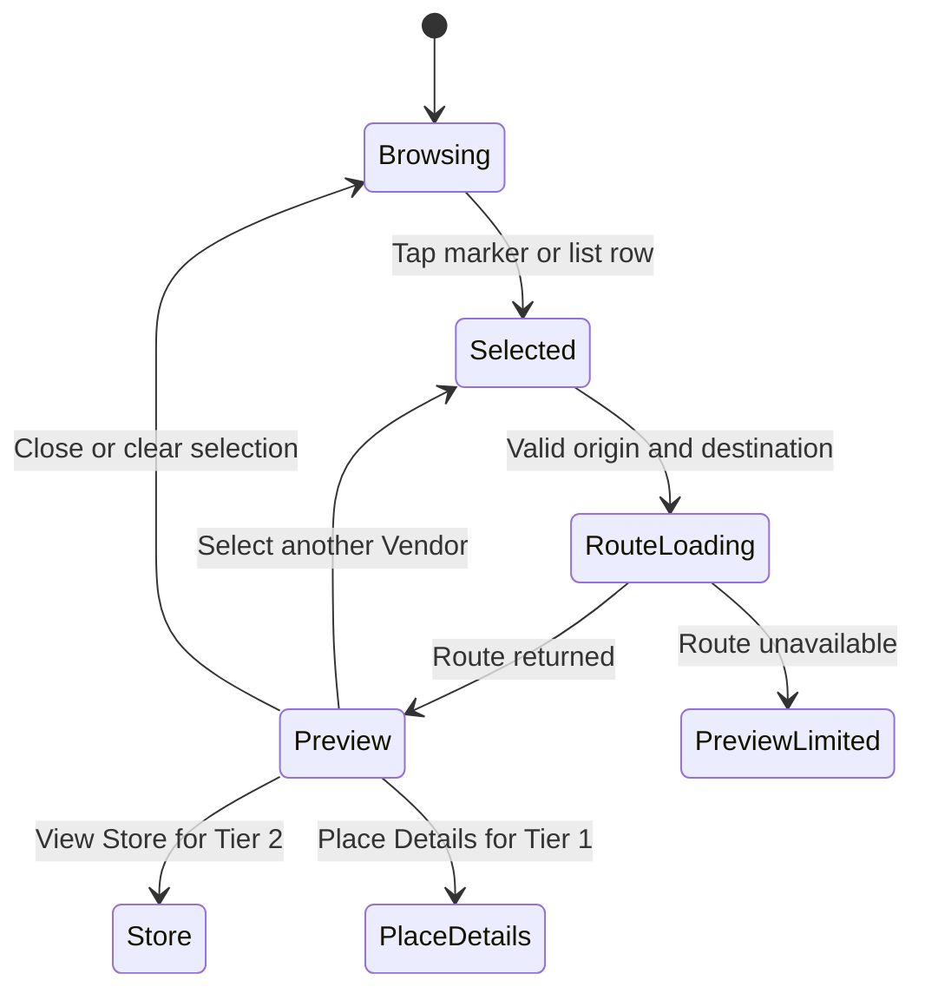
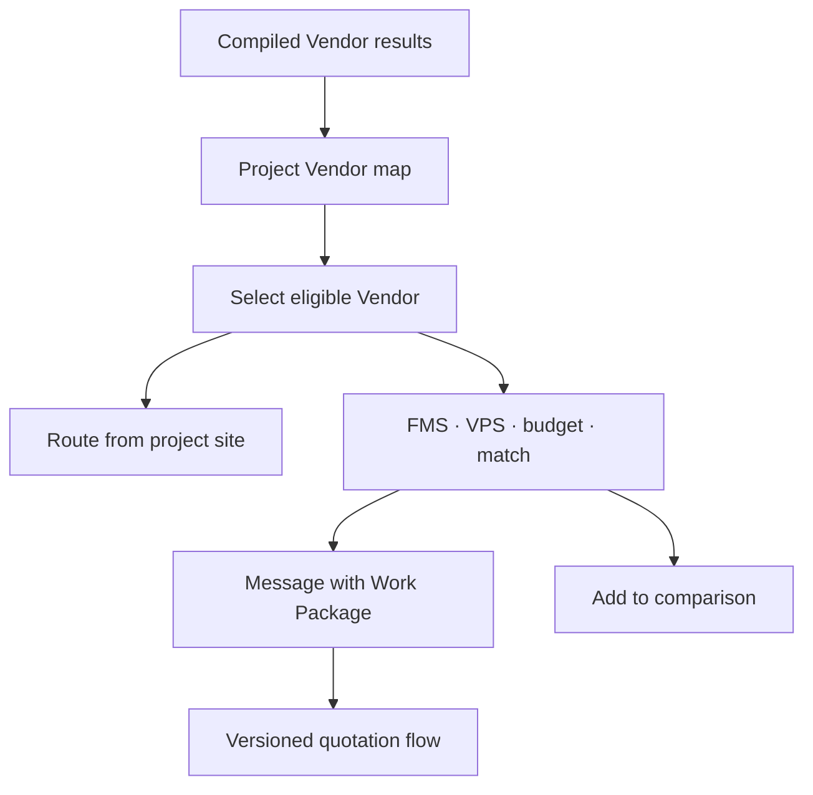

# MateryalPH UI/UX Implementation Planner

**Status:** Approved UI implementation reference  
**Planner date:** 5 September 2026  
**Typeface:** Inter  
**Primary visual direction:** Professional construction marketplace; strong, modern, clean, practical, and map-first  
**Buyer platform:** Flutter mobile  
**Vendor/Admin platforms:** React 19, TypeScript, Vite 8, and token-driven Tailwind CSS  
**Design reference:** [Capstone MateryalPH Figma prototype](https://www.figma.com/design/tSnU3YwH6yynbxvfF2jVdT/Capstone_MateryalPH?node-id=0-1)  
**Code reference:** [Capstone2026Team/MateryalPH](https://github.com/Capstone2026Team/MateryalPH)  
**Design-quality workflow:** [Impeccable](https://github.com/pbakaus/impeccable)

## 1. Purpose

This document turns the approved MateryalPH workflows and the existing Figma prototype into one implementation-ready UI plan. The prototype is a visual reference, not the authority for product behavior. Its recognizable orange construction identity, compact mobile layout, map-first home, radius controls, rounded controls, and bottom-sheet pattern are retained. Outdated terminology, authentication behavior, labels, scores, information architecture, and unsupported features are replaced by the approved workflows.

This planner defines:

- The source-of-truth order developers must follow.
- Design tokens shared by Flutter, Vendor React, and Admin React.
- Page inventories and navigation for all three platforms.
- Detailed Buyer Map Home and Project-Based Procurement Map behavior.
- Tier 1 Directory Supplier and Tier 2 Verified Vendor presentation.
- Motion, route-line animation, responsive behavior, accessibility, and failure states.
- Component boundaries and suggested code organization.
- Figma-to-code and Impeccable review procedures.
- Acceptance criteria that can be tested before a UI phase is accepted.

## 2. Source Priority and Conflict Resolution

When two references disagree, use this order:

1. Approved MateryalPH System, Buyer, Vendor, and Admin workflows.
2. `MateryalPH_Technical_System_Design.md` and approved Architecture Decision Records.
3. This UI/UX Implementation Planner.
4. Approved OpenAPI schemas and backend state machines.
5. The Figma prototype for visual direction and composition.
6. Existing scaffold code.

Do not preserve an outdated Figma label or flow merely because it already exists visually. Do not alter an approved business rule merely to simplify a screen. When a screen and API disagree, stop, identify the governing source, and correct the non-authoritative artifact.

## 3. Confirmed UI Decisions

The following decisions are fixed for implementation:

| Decision | Approved behavior |
| --- | --- |
| Buyer primary authenticated page | Map Home; bottom navigation is Map, Explore, Projects, Messages, Profile |
| Theme | Light-first construction/industrial visual language using the approved orange and charcoal palette |
| Typeface | Inter across all platforms |
| Map radius | `5, 10, 20, 30, 40, 50 km`; default 5 km; ask before automatic expansion |
| Dense map markers | Cluster overlapping Vendors when zoomed out; show individual labels as the map separates them |
| Tier 2 marker label | Store name plus VPS; use “New Vendor” when the public minimum sample is not met |
| Tier 1 marker label | Store name plus `Directory`; do not fabricate a VPS |
| Tier 1 rating | A Google rating may appear only inside Place Details, labeled and attributed as Google data |
| Tier 2 marker interaction | Select marker, animate route, open preview sheet, then use explicit `View Store` action |
| Route origin on Map Home | Buyer-selected location; current device location only after permission and explicit selection |
| Route origin in a Project | Project site saved on the Work Package/Project |
| Route mode | Driving estimate for procurement; no live delivery GPS or fake moving-vehicle indicator |
| Project candidate scope | Eligible Tier 2 Verified Vendors only; Directory Suppliers cannot transact or quote |
| Map alternative | Every map has an equivalent synchronized list, usable without location permission |
| Repository layout | Standardize the early scaffold into `apps/*`, `services/*`, and `packages/*` before feature development |
| Web baseline | React 19 + TypeScript + Vite 8 + Tailwind, with shared semantic tokens |
| Design evaluation | Use Impeccable commands and detector for React surfaces, plus native Flutter accessibility and visual tests |

## 4. Prototype and Repository Audit

### 4.1 What to retain from Figma

The following Figma patterns are suitable and should remain recognizable after refinement:

- Compact location selector in the Map Home header.
- Search, notification, and cart actions close to the location context.
- Horizontal radius chips above the map.
- Map-first content with recenter and layer controls.
- Draggable bottom sheet that preserves map context while showing Vendor details.
- Five-destination Buyer bottom navigation.
- Rounded buttons and chips, restrained shadows, white surfaces, and orange accents.
- Store preview containing availability, distance, estimated time, categories, trust information, and actions.
- Project Vendor comparison using budget, distance, match, quotation, and score information.

Key inspected Figma frames include:

| Figma node | Existing purpose | Implementation treatment |
| --- | --- | --- |
| `1:17996` | Home Map 5 km | Primary visual reference for Buyer Map Home |
| `1:18108` | Project Vendor Selection map | Composition reference for Project-Based Procurement Map |
| `1:18143` | Registered Vendor selection | Convert to Tier 2 Verified Vendor preview |
| `1:18341` | Unregistered Vendor selection | Convert to Tier 1 Directory Supplier Place Details |
| `1:22276` | Explore | Retain catalog/search intent; rebuild using approved filters and product data |
| `1:20170`, `1:20346`, `1:20446` | Storefront views | Consolidate into one accessible Tier 2 Store page with sections/tabs |

### 4.2 What must be replaced

| Outdated prototype element | Required replacement |
| --- | --- |
| Registered / Unregistered / Preferred | Verified Vendors / Directory Suppliers / Favorite Suppliers |
| Four-digit verification code | Six-digit email OTP |
| Phone/SMS recovery | Verified email recovery; no SMS flow |
| `Message` navigation label | `Messages` |
| Generic star rating shown as Vendor performance | Distinguish product rating, Google rating, FMS, and VPS explicitly |
| VPS for every supplier | VPS/New Vendor for Tier 2 only; `Directory` for Tier 1 |
| Weather temperature pill | Remove completely |
| Roboto on selected buttons | Inter everywhere |
| Hard-coded 375 px page behavior | Responsive safe-area layout supporting compact and large phones |
| Static image map | Google Maps SDK backed by approved Laravel endpoints and real state handling |
| Unlabeled pins | Store-name labels plus VPS/New Vendor or Directory semantics |
| Route line that can appear as live tracking | One-time route reveal for distance/ETA only |
| Misspelled labels such as “Vendor Selctecion” and “Quatation” | Approved terminology and reviewed interface copy |

### 4.3 Current repository state

The public repository is an early integration scaffold, not yet a design-system implementation:

- Buyer Flutter currently keeps prototype logic in `lib/main.dart` and `lib/main_new.dart`.
- The Buyer theme still uses an indigo seed and must be replaced by MateryalPH tokens.
- Vendor and Admin are React 19/Vite 8 JavaScript scaffolds with only root CSS/App files.
- There is no shared component/token package yet.
- Laravel is already constrained to Laravel 13, but the root README still contains an older Laravel 11 description and PHP prerequisite conflict.
- Laravel currently includes Sanctum while the approved technical design specifies Passport; resolve this through the authentication ADR and keep only one intentional primary API authentication design.

### 4.4 Approved repository migration

Perform this as a reviewed repository-foundation change before substantial UI development. Preserve Git history with `git mv`; never delete working files during the move.

| Current path | Target path |
| --- | --- |
| `Flutter_Mobile_Interface_Buyer` | `apps/buyer-mobile` |
| `React_Web_interface_Vendor` | `apps/vendor-web` |
| `React_Web_interface_Admin` | `apps/admin-web` |
| `Laravel_Main Application` | `services/api` |

Then create:

```text
packages/
├── api-contract/
├── design-tokens/
├── web-ui/
└── shared-config/
docs/
├── workflows/
├── architecture/
├── design/
└── test-plans/
```

Update imports, scripts, README commands, CI paths, Docker contexts, and editor tasks in the same change. Verify all four applications still start before committing the migration.

## 5. Experience Principles

1. **Map first, decision second.** Geography gives context; the bottom sheet/list supplies the facts required to decide.
2. **Progressive disclosure.** Show name, tier, score, distance, ETA, and primary action first. Put detailed ratings, categories, terms, and provenance behind the expanded sheet.
3. **Trust must be explainable.** `Verified Vendor`, `Directory`, `VPS`, `FMS`, `Google rating`, `PS/ICC`, and `New Vendor` must never look interchangeable.
4. **One obvious next action.** A screen may offer secondary actions, but only one filled primary button should dominate a decision area.
5. **No invented certainty.** When route, stock, price, score, or provider data is unavailable, say so and offer a safe retry or alternative.
6. **Industrial, not decorative.** Use strong type, measured spacing, clear dividers, purposeful icons, and limited ornament.
7. **Motion explains change.** Animation connects a selected pin to its route and details; it never delays work or pretends to be live tracking.
8. **Accessibility is structural.** Map alternatives, visible labels, focus order, semantics, contrast, and reduced motion are part of the component contract.

## 6. Design System

### 6.1 Color tokens

The user's approved palette remains the brand foundation. The deeper orange action token is added so white button text meets accessibility contrast while `#F97316` remains visibly central to the identity.

| Token | Value | Use |
| --- | --- | --- |
| `brand.orange.50` | `#FFF7ED` | Selected surface, subtle callout background |
| `brand.orange.100` | `#FFEDD5` | Hover/selected soft background |
| `brand.orange.300` | `#FDBA74` | Decorative accent and route halo |
| `brand.orange.500` | `#F97316` | Primary brand accent, active nav icon, selected outline, price highlight |
| `brand.orange.600` | `#EA580C` | Strong icon/outline and focus-adjacent accents |
| `action.primary` | `#C2410C` | Accessible filled primary button with white text |
| `action.primary.pressed` | `#9A3412` | Pressed state |
| `text.strong` | `#1F2937` | Headings and primary body text |
| `text.secondary` | `#475569` | Supporting text on white/off-white only |
| `border.default` | `#E5E7EB` | Dividers, inputs, cards, table lines |
| `surface.canvas` | `#F8FAFC` | Page/app background |
| `surface.primary` | `#FFFFFF` | Cards, sheets, navigation, dialogs |
| `status.warning` | `#FBBF24` | Warning icon/background with charcoal text |
| `status.success` | `#16A34A` | Success status with icon/text label |
| `status.error` | `#DC2626` | Error/destructive state with text and icon |
| `status.info` | `#2563EB` | Informational status and route alternative |
| `focus.ring` | `#2563EB` | Visible keyboard focus independent of brand state |
| `overlay.scrim` | `rgba(15, 23, 42, 0.42)` | Modal/sheet background scrim |

Rules:

- Do not use white normal-size text on `brand.orange.500`; use charcoal text, an outlined treatment, or `action.primary` for a filled white-label button.
- Never communicate a tier, score, stock condition, budget status, or error using color alone.
- Do not use low-contrast gray copy over orange/yellow/color-filled surfaces.
- Map pins combine color, shape/icon, and text label.
- High-contrast mode must preserve outlines, text, and selected state when map colors change.

### 6.2 Map semantics

| Entity/state | Marker treatment | Label |
| --- | --- | --- |
| Tier 2 Verified Vendor | Orange construction-pin shape with verified check | Store name + `VPS 4.7` or `New Vendor` |
| Tier 1 Directory Supplier | Steel-gray outlined pin with directory/building glyph | Store name + `Directory` |
| Favorite Tier 2 Vendor | Verified marker plus visible star tab | Same Tier 2 score label |
| Buyer-selected location | Blue location dot with white border | `Your selected location` in accessibility label |
| Project site | Charcoal/orange hard-hat or project marker | Project/Work Package site name |
| Selected Vendor | 2 px charcoal outer ring, raised label, increased z-order | Full untruncated label where space permits |
| Cluster | Tier-aware segmented cluster with numeric count | Accessible count, e.g. `12 suppliers in this area` |

Do not label a Google rating as VPS. Do not label a Tier 1 supplier as verified. A Tier 2 Vendor below the required score sample shows `New Vendor`, not an artificial neutral rating.

### 6.3 Typography

Use Inter through bundled/licensed app assets or a controlled web-font strategy with fallback metrics. Do not fetch fonts at runtime from an unapproved third party.

| Style | Size/line height | Weight | Use |
| --- | --- | ---: | --- |
| Display | 32/40 | 700 | Public landing hero only |
| H1 | 28/36 | 700 | Desktop page title; large mobile title |
| H2 | 22/30 | 700 | Section title, expanded sheet title |
| H3 | 18/26 | 600 | Card/section heading |
| Body large | 16/24 | 400 | Primary form and detail copy |
| Body | 14/21 | 400 | Standard interface copy |
| Body strong | 14/21 | 600 | Emphasis, totals, important labels |
| Label | 12/16 | 600 | Chips, metadata, field labels |
| Caption | 11/16 | 500 | Secondary metadata; never critical content alone |

Use sentence case. Avoid all caps except short stable status codes inside accessible status components. Support system text scaling without clipping or hiding actions.

### 6.4 Spacing, sizing, radius, and elevation

- Base spacing unit: 4 px.
- Common spacing: 4, 8, 12, 16, 20, 24, 32, 40, 48, and 64 px.
- Mobile page gutters: 16 px; allow 20–24 px on wider phones.
- Desktop content: 24–32 px gutters; readable maximum content width 1440 px.
- Minimum interactive target: 44×44 px; never below WCAG's 24×24 CSS-pixel minimum.
- Input/button height: 48 px mobile, 40–44 px dense desktop tables, unless content requires more.
- Radius: 8 px controls, 12 px cards/inputs, 16 px sheets, pill only for chips/status/segmented controls.
- Avoid nested cards. Use one surface, spacing, dividers, and section headings before adding another bordered container.
- Elevation level 1: subtle border plus `0 1px 2px rgba(15,23,42,.08)`.
- Elevation level 2: floating controls/sheets using `0 8px 24px rgba(15,23,42,.14)`.
- Selected marker label may use elevation level 2; routine cards stay level 1 or flat.

### 6.5 Icons and imagery

- Use one consistent outlined/filled icon family with verified licensing.
- Icons must have accessible names when actionable and be hidden from assistive technology when decorative.
- Store/logo images use deterministic aspect ratios and meaningful alternatives.
- Product images use 4:3 or 1:1 containers with `BoxFit.cover`/`object-cover` and a neutral fallback.
- Never recreate Figma-exported brand artwork from memory. Export approved assets once, optimize them, commit non-sensitive assets, and record their source.
- Google map/provider logos and attribution must remain visible and unobstructed.

## 7. Responsive Layout System

### 7.1 Buyer mobile

| Width | Behavior |
| ---: | --- |
| `<360 px` | Compact labels, horizontally scrollable radius chips, full-width sheets, no clipped actions |
| `360–479 px` | Primary phone layout based on the Figma 375 px composition |
| `480–767 px` | Wider mobile; allow two-column product grids only where scanning improves |
| `≥768 px` Flutter tablet | Navigation rail or centered constrained content; map/details may use split view |

Use safe areas for camera notches, system bars, gesture indicators, and keyboard insets. Do not encode iPhone-specific status bars into app content.

### 7.2 Vendor and Admin web

| Breakpoint | Navigation/content behavior |
| --- | --- |
| `<640 px` | Drawer navigation, one-column forms, stacked actions, horizontal table alternatives |
| `640–1023 px` | Compact sidebar or drawer; two-column summaries when useful |
| `1024–1439 px` | Persistent sidebar; main content grid; sticky page actions where safe |
| `≥1440 px` | Constrained readable content with analytics expansion; do not stretch forms edge to edge |

Tables must reflow into labeled row cards or support deliberate horizontal scrolling with frozen identifiers. Critical actions cannot disappear at smaller widths.

## 8. Buyer Navigation and Page Inventory

### 8.1 Global shell

The five destinations are fixed:

| Destination | Purpose | Preserved state |
| --- | --- | --- |
| Map | Nearby supplier discovery and spatial decisions | Selected location, radius, filters, camera, selected Vendor when valid |
| Explore | Item-Based catalog/search and ranking | Query, filters, sort/tune weights, scroll position |
| Projects | Project and Work Package management | Active project, work package, vendor comparison state |
| Messages | Store conversations and quotation negotiation | Selected conversation and draft text per safe policy |
| Profile | Account, locations, preferences, reports, privacy, and security | Active subsection where appropriate |

Use state restoration carefully: never restore a stale quotation acceptance, expired payment form, TOTP value, password, OTP, or sensitive evidence upload.

### 8.2 Buyer page inventory

| Area | Required pages/states |
| --- | --- |
| Launch | Splash, service maintenance, forced upgrade only when necessary |
| Onboarding | Three concise value slides, Skip, Continue, accessibility labels |
| Authentication | Sign up, six-digit email verification, sign in, Google sign in, forgot/reset password, step-up verification, session-expired |
| Location | Permission education, device location, search address, choose on map, saved locations, project site, manual fallback |
| Map | Map Home, map filters, synchronized supplier list, Tier 1 Place Details, Tier 2 Vendor Preview, route failure |
| Explore | Search home, suggestions/recent search, results, filters, ranking preferences, product details, Vendor store |
| Cart/checkout | Cart, multi-Vendor grouping, delivery/payment selection, fee breakdown, vendor-confirmation state, payment expiry/result |
| Projects | Project list, create/edit, phase/work package, BOM/BOQ editor, compiled results, comparison, Project Vendor Map, notes |
| Messaging | Conversation list, conversation detail, staff identity, attached Work Package, quotation version/change summary, counter-offer |
| Orders | Order list, order detail, timeline, proof, cancellation, refund status, issue/dispute, review |
| Profile | Personal details, saved locations, favorites, ranking preferences, notification settings, sessions/security, reports, privacy requests |

Every page implements loading, empty, populated, validation, disabled, permission-denied, offline/provider-failure, retry, and success states where applicable.

## 9. Detailed Buyer Map Home Specification

### 9.1 Layout

The authenticated Map Home is the Buyer's home page.

1. **Top safe-area header:** `Location` label, selected location name, dropdown chevron, Search, Notifications with unread count, and Cart with item count.
2. **Radius/filter bar:** Tune button followed by horizontally scrollable 5/10/20/30/40/50 km chips. The selected radius uses brand accent plus text/shape, not color alone.
3. **Map viewport:** selected-location marker, radius boundary, clustered Vendor markers, selected route, provider attribution.
4. **Floating controls:** recenter, layers/legend, and `List view`. Place controls away from Google attribution and sheet drag area.
5. **Context sheet:** collapsed handle and `Vendors near you` summary when no Vendor is selected; selected Vendor preview when a pin/list row is selected.
6. **Bottom navigation:** Map, Explore, Projects, Messages, Profile with text labels at all times.

The sheet uses three snap positions:

- Peek: title/count or selected Vendor name and main score.
- Half: decision essentials and primary action.
- Expanded: full Place/Vendor detail with scrollable content.

### 9.2 Marker rendering and clustering

- Fetch only suppliers intersecting the current viewport/radius and authorized filters.
- At low zoom, cluster spatially overlapping results. The initial tuning targets are: strong clustering below zoom 11, adaptive clustering from zoom 11–13.9, and individual labels near zoom 14+, subject to device/performance validation.
- A cluster announces its total and tier composition. Selecting it zooms to bounds or expands the cluster; it does not choose a Vendor arbitrarily.
- When individual markers do not collide, display store name plus score/tier label.
- On label collision, preserve the selected label, then nearest/highest-ranked visible labels, while keeping all suppliers discoverable through the synchronized list. This is a rendering rule, not a ranking change.
- Marker virtualization must prevent rebuilding every marker on minor camera movement.
- Do not request a route for every visible marker. Request a route only for the selected Vendor.

### 9.3 Vendor selection sequence



On selection:

1. Give the marker selected semantics, raise its z-index, reveal its complete label, and synchronize the list row.
2. Move the camera only enough to keep the marker, route, and preview visible. Do not disorient the Buyer with a full reset.
3. Start the route request from the active selected location to the Vendor.
4. Show a route skeleton in the details area; do not display guessed travel time.
5. When the route arrives, reveal the polyline from origin to destination and update distance/ETA together.
6. Open the preview sheet. Announce the selected Vendor and route result to assistive technology.
7. If the route fails, keep the Vendor selected, show straight-line proximity only when available, label ETA `Unavailable`, and offer Retry.

### 9.4 Route-line motion

- Camera adjustment: 320–450 ms using ease-out cubic.
- Marker selection: 160 ms scale/outline transition; no bounce.
- Route reveal: 600–900 ms stroke reveal following the returned polyline.
- Sheet entrance: 220–280 ms ease-out.
- Use directional chevrons or a subtle static direction treatment after reveal.
- Do not animate a vehicle along the route because MateryalPH does not provide live tracking.
- With Reduce Motion enabled, skip the stroke animation and camera tween; render the final route and sheet immediately.
- Cancel the previous request/animation when another Vendor is selected. Never let a stale route overwrite the current selection.

### 9.5 Tier 2 Verified Vendor preview

The initial/half sheet shows:

- Store logo, store name, Verified Vendor badge, Favorite toggle.
- `VPS 4.7` with an info action, or `New Vendor — Building Track Record`.
- Distance and driving ETA with timestamp such as `Estimated now`.
- Open/closed status based on approved public store hours.
- Fulfillment methods: Pickup, Vendor Delivery, or Both.
- High-level categories and service radius.
- Primary `View Store`; secondary `Message`.

The expanded sheet may add score components, public badges, approved contact information, store address, hours, policies, and report action. It must not reveal exact inventory quantities, staff personal contact details, payout information, or private documents.

### 9.6 Tier 1 Directory Supplier Place Details

Tier 1 remains information-only. The sheet may display only provider-returned and policy-permitted fields:

- Name and `Directory Supplier` label.
- Google attribution close to provider data.
- Formatted address.
- Public phone number, website, and opening hours when returned.
- Google rating and rating count only when requested and shown as `Google rating`.
- Distance and driving ETA from the selected origin.
- `Call`, `Open in Google Maps`, `Website`, or `Share` when available.

Do not show Add to Cart, Buy, Message in MateryalPH, VPS, Verified Vendor, inventory, MateryalPH reviews, or a MateryalPH Storefront action. Missing provider fields are omitted rather than shown as misleading placeholders.

### 9.7 Map Home states

| State | Required UI |
| --- | --- |
| First entry | Brief location explanation; choose device location or enter manually |
| Permission denied | Manual location search and map-pin placement; no blocking modal loop |
| Loading suppliers | Map remains interactive; skeleton in list/sheet; progress semantics |
| No suppliers in 5 km | Explain result and ask before expanding to the next radius |
| Offline | Cached map/list context if permitted, offline banner, no stale ETA presented as current |
| Places unavailable | Keep verified MateryalPH Vendors usable; explain Directory data is temporarily unavailable |
| Routes unavailable | Keep details; show ETA unavailable and safe retry |
| Location changed | Clear stale route/selection when invalid; refresh using explicit visible state |
| Too many results | Cluster and paginate/list; never silently omit based on client limits |

## 10. Explore Home and Item-Based Discovery

Explore complements, rather than duplicates, Map Home.

- Header: selected location, search, notifications, cart.
- Search prompt: `Find construction materials near your site`.
- Quick categories: Cement, Steel, Lumber, Electrical, Plumbing, Roofing, Finishing, Tools/Hardware, and configured categories.
- Recent searches and saved/favorite suppliers are optional personalized sections with clear management actions.
- Results may use a responsive grid on larger devices and a dense accessible list on compact devices.
- Product cards show product image, canonical material/variant, price/unit, product rating or sample message, distance, availability label, Vendor name/tier, and one relevant action.
- `Best Price` appears only when the defined comparable-product rule is satisfied.
- Tune control exposes Item-Based personalized SRS weights, requires 100%, and offers Reset to Default.
- Filter sheet supports category, verified/directory/favorite supplier, stock availability, price range, fulfillment, distance, product compliance, and rating eligibility without hiding active filters.
- Selecting `View on Map` focuses the same supplier/product context on Map Home without losing the search.

## 11. Detailed Project-Based Procurement Map

### 11.1 Entry and purpose

Open this map from a selected Project and Work Package after the system compiles eligible Vendor results. Only eligible Tier 2 Verified Vendors appear because Directory Suppliers cannot submit quotations or transact.

The screen answers four questions:

1. Which eligible Vendors are near the project site?
2. How strong is each Vendor's platform performance?
3. How well does each Vendor match the Work Package and budget?
4. What can the Buyer do next: review, note, message, compare, or select?

### 11.2 Layout

1. **Context header:** Back, Project name, Work Package name, result count, overflow/help.
2. **Context summary strip:** Phase budget, package line count, active radius, and personalized FMS indicator.
3. **Radius/filter row:** Same 5–50 km component and tune/filter entry as Map Home.
4. **Map:** Project site origin, radius boundary, eligible Vendor clusters/labels, selected route.
5. **Map/list switch:** Synchronized candidate list with identical selection.
6. **Candidate sheet:** score/budget/match summary and inquiry actions.

### 11.3 Marker and selection content

Each individual marker shows store name plus VPS/New Vendor. The selected candidate sheet shows:

- Store name, Verified Vendor badge, VPS/New Vendor, public performance badges.
- Driving distance and ETA from the Project site.
- FMS score and a `How this was calculated` expansion.
- Material-match completeness: matched, missing, and proposed-substitution counts.
- Estimated/quoted materials total, delivery, processing fee when applicable, and total.
- Phase budget result: Under Budget, Within Budget, or Over Budget with exact difference.
- Inventory freshness/confirmation status without exact private quantities.
- Fulfillment options and estimated trip/vehicle summary when available.
- Quotation status/deadline when an inquiry already exists.
- Primary contextual action: `Message Vendor`, `Review Latest Quote`, or `Compare`.
- Secondary actions: `View Store`, `Add Note`, `Favorite`.

`Add Note` is informational only and explicitly says `No Vendor response required`. `Message Vendor` starts or resumes an inquiry and auto-attaches the locked Buyer Work Package reference plus a Vendor-editable duplicate. The attachment explanation must be visible before the first message is sent.

### 11.4 Project map flow



The map and list use the same candidate state. Selecting a candidate in either surface updates both. Accepting one Vendor's latest quotation expires other open inquiries for that Work Package according to the workflow but preserves their history.

### 11.5 Project map errors and edge cases

- If the Project site is missing, block route/nearby ranking and lead the Buyer to set the site.
- If a candidate becomes ineligible, show the reason and remove quote/select actions without erasing history.
- If the Vendor changes the quotation, mark the earlier version superseded and require review of the latest change summary.
- If stock revalidation fails at acceptance, do not send the Buyer to payment; show affected lines and return to inquiry.
- If the budget is absent, show `No phase budget set`; do not infer Under/Over.
- If routes fail, FMS may use the approved fallback/last computed distance rule only when the backend explicitly marks provenance and freshness.
- If a Work Package has many candidates, clustering and list pagination must not change ranking order silently.

## 12. Storefront, Product, and Vendor Identity

### 12.1 Tier 2 Store page

Consolidate the prototype's separate storefront experiments into one route with these sections:

- Store header: logo, name, verification, favorite, location/distance, fulfillment, public contact.
- Overview: description, hours, service area, supplier classifications, performance summary.
- Products: searchable/filterable published listings only.
- Reviews: eligible MateryalPH reviews and public score sample explanations.
- Compliance: approved public PS/ICC evidence/status for regulated listings; do not expose private documents.
- Policies: fulfillment, cancellation, NRPC explanation, and store-provided public terms that do not override platform rules.

Use sticky tabs only when they remain accessible with text scaling. The primary action changes with context: Browse Products, Message Store, or Return to Work Package.

### 12.2 Staff identity in messaging

Conversation headers display store logo/name, Verified Vendor badge where applicable, staff avatar/display name/role, and `You are chatting with…` or `Handled by…`. Never display staff email, login identifier, or personal phone. A transfer creates a visible system message and accessible announcement.

## 13. Vendor Public Landing Page

The Phase 1 Vendor landing page should use the same brand system without copying the mobile layout directly.

### Recommended section order

1. Sticky header: MateryalPH logo, How It Works, Features, Trust & Compliance, Sign In, `Register Your Store`.
2. Hero: strong procurement/vendor value statement, two actions, product/map visual using real UI composition rather than a generic dashboard collage.
3. Proof of workflow: Discover locally → Verify products/store → Quote/confirm → Fulfill and get paid.
4. Vendor benefits: local visibility, inventory/listings, Item/Project orders, structured quotation, performance insights.
5. Trust/compliance: Vendor verification, PS/ICC handling, Xendit onboarding, and the approved 2% Vendor-paid commission under FIN-03 with separate processor-fee disclosure.
6. Role/team operations: Owner and approved staff roles.
7. FAQ: eligibility, onboarding, payments, fees, listings, refunds, and support.
8. Final CTA and complete footer with policies/contact/accessibility statement.

Avoid unsupported marketing claims such as guaranteed sales, instant activation, escrow protection, real-time delivery tracking, automatic compliance approval, or no fees. Use real product language from the workflows.

## 14. Vendor Portal UI Planner

| Area | Primary pages/components |
| --- | --- |
| Authentication | Sign in, sign up, email OTP, Google, recovery, TOTP, invitation acceptance |
| Onboarding | Separate Store Verification and Store Setup steppers, save draft/Finish Later, exact Business Type and document requirements, contacts, address/map, classification, tax profile, documents, bulk capability, fulfillment and conditional delivery, mandatory Xendit status, and activation checklist |
| Dashboard | Separate Store Activation and Marketplace Discoverability states, action-required queue, limited onboarding dashboard, order/quote summaries, inventory alerts, compliance expiries, and performance trend |
| Catalog | Listing table/cards, create/edit wizard, variants, media, PS/ICC evidence, publication state |
| Inventory | SKU/variant ledger, adjustments, reservations, soft holds, stale stock, auto-accept allotments/caps |
| Orders | Status-filtered list, job order, confirmation/revision, manual NRPC, fulfillment actions, cancellation result |
| Messages/quotes | Conversations, staff identity, Work Package copies, quote builder, versions, deadline, counter-offer, change summary |
| Team | Optional members, individual fixed-role invitations, Owner delegation toggle, invitation expiry, suspension/reactivation, and immutable action history |
| Delivery | Self-Pickup, Vendor Delivery, or Both; conditional vehicles, capacities, dimensions, fees, service radius, and assignment only when Vendor Delivery applies |
| Finance/reporting | Payment/refund status, Vendor Tax Profile reference, processing fees, approved 2% Vendor-paid monthly commission, Xendit connection, order/export reports; no wallet/escrow UI |
| Settings | Store public information, notifications, sessions/security, allowed integrations/status only |

In the authenticated Vendor Portal, the Business Type selector uses exactly **Sole Proprietorship**, **Partnership**, **Corporation**, **One Person Corporation (OPC)**, and **Cooperative**; the selected value controls the applicable legal-name and evidence fields. Store Verification is submitted for manual Admin review and shows `PENDING_VERIFICATION`, a confirmation, and **Proceed to Store Setup**. Store Setup may continue while review is pending, and **Finish Later** returns the Vendor to a limited Dashboard with separate checklists and correction states. Requirement Level (`REQUIRED`, `OPTIONAL`, `CONDITIONALLY_REQUIRED`) is separate from Requirement Status (`NOT_STARTED`, `IN_PROGRESS`, `SUBMITTED`, `PENDING_VERIFICATION`, `APPROVED`, `COMPLETED`, `CHANGES_REQUIRED`, `REJECTED`, `EXPIRED`, `NOT_APPLICABLE`). `NOT_APPLICABLE` is reserved for a non-applicable conditionally required item. Store Activation requires mandatory verification approval, setup completion, required Xendit onboarding, accepted Commission Terms, and no blocking hold; it does not require a product listing. Marketplace Discoverability is evaluated separately from activation and remains unavailable until eligible listing, inventory, product-compliance, serviceability, and other discovery conditions pass. Team Accounts are optional; invited staff use individual fixed-role invitations, never repeat onboarding, and cannot bypass Store Activation.

Use a persistent desktop sidebar and a compact mobile drawer. Role permissions affect both visible actions and server authorization. A hidden button is never the authorization mechanism.

## 15. Admin Portal UI Planner

| Area | Primary pages/components |
| --- | --- |
| Operations home | Role-specific work queue, SLA/deadline alerts, provider/job health, recent audited actions |
| Vendor verification | Evidence viewer, checklist, official reference, Approve/Reject/Return, reason, notification preview |
| Product compliance | Listing/evidence comparison, PS/ICC decision, issue/expiry fields, immutable review history |
| Orders/refunds | Read-only cross-party timeline, payment/refund events, reconciliation state, escalation |
| Disputes/appeals | Case timeline, evidence, parties, decision form, remedy/refund outcome, conflict check |
| User enforcement | Buyer/Vendor state, case evidence, reasoned action, session effects, appeal path |
| Review moderation | Report reason, review evidence, decision history; no performance-badge manual award |
| Platform settings | Versioned non-secret defaults, SRS/FMS validation, feature flags only where approved |
| Audit | Append-only searchable events with actor, resource, correlation ID, before/after, export controls |
| Philippines analytics | Accessible map/table drilldown, global filters, counts, GMV trends, rates, response time, demand heatmap, DAU/WAU/MAU |

The Admin Philippines map follows the approved PSGC hierarchy and privacy suppression. It is visually related to Buyer maps but uses choropleth/aggregate interactions rather than Vendor pins. Never expose exact Buyer coordinates.

## 16. Shared Component Contracts

Build behaviors once per platform, not as page-specific copies.

| Component | Contract |
| --- | --- |
| `AppShell` | Safe areas, navigation, authenticated state, global banners, responsive layout |
| `LocationSelector` | Active origin, manual fallback, permission state, saved/project locations |
| `RadiusSelector` | Fixed values, 5 km default, visible selected state, confirmation before auto expansion |
| `SupplierMarker` | Tier, store name, VPS/New Vendor/Directory, favorite, selected, accessible label |
| `SupplierCluster` | Count, tier composition, expand/zoom behavior, accessibility description |
| `RouteOverlay` | loading/success/failure/stale states, origin/destination version, reduced-motion behavior |
| `SupplierPreviewSheet` | Tier-specific data and actions; three snap positions; keyboard/screen-reader handling |
| `ScoreBadge` | Type (`VPS`, `FMS`, product, Google), value/sample/provenance, explanation action |
| `StatusBadge` | Text + icon + semantic color; standardized state mapping |
| `MoneyBreakdown` | Materials, delivery, processing fee, NRPC allocation, total, refund effects |
| `Deadline` | Relative countdown plus exact Asia/Manila date/time; expired behavior |
| `QuotationVersionCard` | version, latest/superseded, viewed state, changes, deadline, valid actions |
| `WorkPackageAttachment` | locked original vs Vendor working copy, version/change summary |
| `EmptyState` | specific cause, helpful next action, no decorative overdesign |
| `AsyncState` | skeleton/progress, retry, safe error, correlation ID where supportable |
| `ConfirmDialog` | consequence, exact object, destructive distinction, focus management |

Component APIs use semantic properties, not raw colors. For example, pass `tier: directory` rather than `color: gray` and `scoreKind: vps` rather than a generic star.

## 17. Motion and Interaction Specification

### 17.1 Motion tokens

| Token | Duration | Use |
| --- | ---: | --- |
| `motion.instant` | 80 ms | Press feedback only |
| `motion.fast` | 160 ms | Icon, focus/hover, selected marker |
| `motion.standard` | 240 ms | Sheet/card state, filter application |
| `motion.slow` | 360 ms | Page-level spatial transition |
| `motion.route` | 600–900 ms | Selected route stroke reveal |

Use ease-out cubic for entrances, ease-in cubic for exits, and standard emphasized easing for shared-axis transitions. Do not use bounce, elastic, excessive parallax, continuous glow, or gratuitous loading animation.

### 17.2 Purposeful motion list

- Selected map marker raises and gains outline.
- Route line reveals once after a successful route response.
- Preview sheet follows marker selection and maintains gesture continuity.
- Radius boundary interpolates only after a Buyer-selected radius change.
- Filter chips show immediate selected state while data refresh is clearly pending.
- Quotation update highlights changed fields once and then settles.
- Order timeline adds a newly confirmed milestone without replaying the entire animation.
- Success feedback uses a short check/state change, not confetti for routine tasks.

All motion must preserve input responsiveness and support `prefers-reduced-motion`/platform Reduce Motion.

## 18. Map and Geospatial Implementation Contract

### 18.1 Client/server responsibility

| Concern | Owner |
| --- | --- |
| Render base map, markers, clusters, selected polyline | Flutter Google Maps client |
| Enforce radius, tier eligibility, filters, pagination, ranking | Laravel API/PostGIS |
| Fetch policy-permitted Google Place details | Laravel Google adapter where server use is required; client only where SDK policy requires |
| Compute driving distance/ETA | Laravel Routes adapter using server credential and strict field mask |
| Store Vendor coordinates | PostgreSQL/PostGIS with controlled precision and authorization |
| Store Buyer/project locations | Laravel/PostgreSQL under privacy/retention controls |
| Track selection/camera UI | Flutter local presentation state |
| Cache provider responses | Adapter under provider terms, attribution, TTL, and field-specific restrictions |

### 18.2 Route request contract

The client sends an opaque origin reference or approved coordinates plus destination Vendor ID and a selection request version. The API returns:

```json
{
  "data": {
    "origin_version": "uuid",
    "vendor_id": "uuid",
    "distance_meters": 4200,
    "duration_seconds": 1080,
    "duration_basis": "TRAFFIC_AWARE",
    "computed_at": "2026-09-05T10:00:00Z",
    "encoded_polyline": "provider-encoded-value"
  }
}
```

The client applies the response only when `vendor_id` and `origin_version` still match the current selection. The UI formats distance/ETA locally but never recomputes the authoritative route from straight-line distance. Request only required Routes fields.

### 18.3 Performance and privacy

- Debounce camera-idle queries; do not query continuously during every pan frame.
- Cancel/supersede stale client requests.
- Use server-side bounds/radius limits and maximum page sizes.
- Cluster on the client from bounded results or use server clustering when data volume requires it.
- Avoid logging precise Buyer/project coordinates in analytics or error monitoring.
- Do not retain device location longer than needed unless the Buyer explicitly saves it.
- No background location collection.
- Do not expose Google server keys in Flutter or React bundles.
- Keep provider attribution visible and comply with Google field, display, and caching requirements.

## 19. Implementation Architecture

### 19.1 Flutter Buyer structure

```text
apps/buyer-mobile/lib/
├── app/
│   ├── app.dart
│   ├── router.dart
│   └── bootstrap.dart
├── core/
│   ├── api/
│   ├── auth/
│   ├── config/
│   ├── errors/
│   ├── location/
│   └── telemetry/
├── design_system/
│   ├── color_tokens.dart
│   ├── typography.dart
│   ├── spacing.dart
│   ├── motion.dart
│   ├── theme.dart
│   └── components/
├── features/
│   ├── authentication/
│   ├── map_discovery/
│   ├── explore/
│   ├── storefront/
│   ├── projects/
│   ├── messaging/
│   ├── quotations/
│   ├── orders/
│   ├── payments/
│   ├── disputes/
│   └── profile/
└── main_development.dart
```

Use feature boundaries, generated API clients, immutable view state, and testable repositories. Choose and record the state-management/router libraries in an ADR before broad implementation; do not mix several patterns.

### 19.2 React portal structure

```text
apps/vendor-web/src/            apps/admin-web/src/
├── app/                        ├── app/
├── routes/                     ├── routes/
├── features/                   ├── features/
├── components/                 ├── components/
├── hooks/                      ├── hooks/
├── lib/                        ├── lib/
├── styles/                     ├── styles/
└── main.tsx                    └── main.tsx

packages/web-ui/src/
├── primitives/
├── forms/
├── feedback/
├── data-display/
└── navigation/

packages/design-tokens/
├── tokens.json
├── tailwind.preset.ts
├── web.css
└── generated/
```

Migrate the small JSX scaffold to TypeScript before feature growth. Use strict TypeScript, generated API schemas, route-level boundaries, semantic HTML, and accessible primitives. Share visual primitives and tokens, not role-specific pages or business permissions.

### 19.3 Token synchronization

`packages/design-tokens/tokens.json` is the canonical machine-readable token source. Generate:

- CSS custom properties and Tailwind semantic aliases for React.
- A checked-in generated Dart token file for Flutter.
- Documentation tables or a token preview page.

Generated files carry a header and are not hand-edited. CI fails when generated token outputs drift from `tokens.json`.

## 20. Impeccable Workflow for Codex

Impeccable is a design-quality layer, not the source of MateryalPH product truth. The approved workflows and this planner remain authoritative.

### 20.1 One-time project setup

From the standardized repository root:

```bash
npx impeccable install --providers=codex --scope=project
```

Then open Codex, approve the project hook through `/hooks`, and run:

```text
/impeccable init
/impeccable document
```

Review generated `PRODUCT.md`, `DESIGN.md`, `.impeccable/config.json`, and surface briefs before committing. Do not allow generated project truth to contradict the workflows.

Because Inter is an explicit user-approved brand requirement, document the narrow detector exception rather than changing the font or disabling the detector:

```bash
npx impeccable ignores add-value overused-font Inter --reason "Approved MateryalPH brand typeface"
```

Keep Impeccable shared configuration/design/surface/critique artifacts tracked. Ignore its screenshots, caches, sessions, previews, annotations, local overrides, and runtime data using the current block from the Impeccable documentation.

### 20.2 Per-surface workflow

Run this sequence for a new or significantly revised page:

1. `/impeccable shape <surface>` — clarify hierarchy and interaction before code.
2. Implement using this planner, approved Figma assets, existing components, and the target platform.
3. `/impeccable critique <surface>` — test clarity, trust, hierarchy, and decision load.
4. `/impeccable harden <surface>` — cover failures, long names, localization, loading, empty/offline, and permission states.
5. `/impeccable animate <surface>` — add only the motion specified here.
6. `/impeccable audit <surface>` — accessibility, responsiveness, and performance.
7. `/impeccable polish <surface>` — final token/component alignment.
8. Run deterministic detection on React UI code and supported rendered URLs.

Example:

```text
/impeccable shape Buyer Map Home using docs/design/MateryalPH_UI_UX_Implementation_Planner.md
/impeccable critique Buyer Map Home marker hierarchy and Tier 1/Tier 2 clarity
/impeccable harden Buyer Map Home for denied location, route failure, dense labels, and long store names
/impeccable animate only selected marker, route reveal, and preview sheet
/impeccable audit Buyer Map Home for WCAG 2.2 AA, reduced motion, and small screens
/impeccable polish Buyer Map Home without changing approved workflows
```

Detector examples for the React portals:

```bash
npx impeccable detect apps/vendor-web/src
npx impeccable detect apps/admin-web/src
npx impeccable detect --json apps/vendor-web/src apps/admin-web/src
```

Treat findings as diagnostics. Resolve them or document a narrow, reasoned exception. A clean detector result does not replace human review, device testing, Flutter semantics tests, or WCAG validation.

## 21. Figma-to-Code Procedure

1. Link the exact Figma frame/node in the issue or phase prompt.
2. Retrieve design context for that node before implementation.
3. Compare the frame with the workflow and this planner; list outdated elements explicitly.
4. Extract reusable visual intent: hierarchy, spacing, assets, sheet position, map composition, and interactions.
5. Reuse existing codebase tokens/components before creating new ones.
6. Export exact approved icons/images; do not recreate them approximately.
7. Convert the design to Flutter for Buyer or React/TypeScript for portals. Never paste generated React reference code into Flutter.
8. Replace raw hex values with semantic tokens.
9. Implement all non-happy states and responsive behavior absent from the static frame.
10. Render at target sizes and compare visually.
11. Run Impeccable and accessibility checks.
12. Record deviations with a reason: product correction, accessibility, responsive behavior, performance, provider policy, or component reuse.

Do not use expiring Figma asset URLs in committed production code. Download approved non-sensitive assets into the repository or connect dynamic images to their proper API/storage source.

## 22. Accessibility Acceptance Criteria

- WCAG 2.2 AA target for web and equivalent native mobile semantics.
- All controls have visible labels or unambiguous accessible names.
- Logical focus and traversal order matches visual order.
- Keyboard users can operate sheets, dialogs, menus, tables, filters, map/list switch, and every web action.
- Screen-reader users can select Vendors through the synchronized list without manipulating the visual map.
- Selected map/list state and route results are announced without excessive chatter.
- Minimum 44×44 px product target; never below 24×24 CSS px.
- Normal text meets 4.5:1 contrast and large text 3:1; non-text controls/states meet 3:1 where required.
- Text scales to 200% on web and approved platform scaling on Flutter without clipped content or lost actions.
- Statuses have text and icons, not color alone.
- Timers show exact deadline and do not rely only on motion/countdown.
- Motion respects reduced-motion settings.
- Error messages identify the field/cause, preserve safe input, and provide recovery.
- Forms use visible persistent labels, not placeholder-only labels.
- Modal/sheet focus is trapped/restored correctly on web and traversal is constrained appropriately on mobile.

## 23. Visual and Interaction Test Matrix

### Buyer Map Home

- Compact Android, standard Android, compact iPhone, large iPhone, large text, landscape, and Flutter tablet.
- 0, 1, 10, 50, and maximum bounded Vendor results.
- Mixed Tier 1/Tier 2/Favorite/New Vendor clusters.
- Long Filipino/English store names and missing logos.
- Location allowed, denied, disabled, approximate, manual, and changed.
- Routes success, timeout, zero-results, provider quota/error, and stale response.
- 5 km empty result followed by Buyer-approved expansion.
- Offline/cached state with stale ETA removed.
- Reduced motion and screen reader enabled.

### Project Vendor Map

- No project location, no budget, no eligible Vendors, one Vendor, dense Vendors.
- Personalized/default FMS, missing material lines, substitution, over-budget result.
- Existing inquiry, revised quotation, expired deadline, stock revalidation failure.
- Select map marker vs synchronized list row and verify identical state.

### Vendor/Admin web

- 320, 375, 768, 1024, 1440, and 1920 px viewports.
- Keyboard-only, screen reader, 200% zoom, high contrast, reduced motion.
- Long tables, empty queues, large evidence files, role-denied action, expired session.
- Loading and provider failure without layout shift or duplicate actions.

## 24. UI Phase Integration

| Development phase | Required UI/design work |
| ---: | --- |
| Repository foundation | Standardize paths; migrate portals to TypeScript; create tokens/web-ui; install/configure Impeccable |
| 1 | Theme foundation, auth states for three platforms, Vendor public landing page |
| 2 | App shells, role-aware navigation, profile/security/session/agreement components |
| 3 | Vendor onboarding stepper and activation checklist |
| 4 | Listing wizard, compliance evidence/status components |
| 5 | Inventory, pricing, vehicle/delivery, auto-accept configuration |
| 6 | Buyer location, Map Home, clusters, Tier previews, list alternative, route states |
| 7 | Explore, search/filter/tune, product/store, cart preview |
| 8 | Order/NRPC/manual confirmation/reservation states |
| 9 | Messages, staff identity, quotation versions, changes, counter-offer |
| 10 | Projects, Work Packages, comparison, Project Vendor Map, inquiry attachment |
| 11–13 | Payment, fulfillment, cancellation, refunds, disputes, invoices |
| 14–16 | Reviews/scores/badges, notifications/reports, Admin map/analytics |
| 17 | Full Impeccable audit/polish, WCAG, security/privacy, performance |
| 18–20 | E2E/UAT, Staging visual validation, Production release evidence |

## 25. UI Definition of Done

A screen is complete only when:

1. It matches the approved workflow and uses correct states/terminology.
2. It uses shared semantic tokens and components without unexplained raw styling.
3. It is responsive at the defined target sizes.
4. Loading, empty, error, offline, permission, validation, unauthorized, and success paths are implemented as applicable.
5. Authorization-sensitive actions are backed by server checks.
6. Analytics do not capture prohibited personal/location data.
7. Keyboard, screen reader, text scaling, contrast, target size, focus, and reduced-motion checks pass.
8. Component/widget tests and golden/visual-regression evidence cover critical variants.
9. Figma differences are recorded and intentional.
10. Impeccable critique, harden, animate, audit, polish, and relevant detector checks have been reviewed.
11. API/client contracts are current and no placeholder provider result is presented as real.
12. No secret, credential, private document, precise Buyer coordinate, or sensitive payload appears in code, fixtures, logs, screenshots, or design artifacts.

## 26. Copy-Paste Codex Prompt: UI Foundation and Map Reference

```text
Prepare the MateryalPH UI implementation foundation and the detailed Buyer map reference. Do not implement business features beyond the approved phase scope and do not deploy, push, merge, or commit.

First read AGENTS.md, the four approved workflow documents, MateryalPH_Technical_System_Design.md, and MateryalPH_UI_UX_Implementation_Planner.md. Inspect the current repository and preserve all existing work. The Figma prototype is a visual reference only; workflows and technical documents override outdated Figma content.

Create a reviewed repository-migration plan, then use git-aware moves to standardize these early scaffold paths without deleting files: Flutter_Mobile_Interface_Buyer to apps/buyer-mobile, React_Web_interface_Vendor to apps/vendor-web, React_Web_interface_Admin to apps/admin-web, and Laravel_Main Application to services/api. Update scripts, documentation, Docker/CI paths, and imports. Verify each app still starts before continuing.

Keep Laravel 13/PHP 8.4. Use React 19, TypeScript, Vite 8, and Tailwind for both web portals. Migrate the small JSX scaffolds to strict TypeScript before adding pages. Keep Flutter/Dart for Buyer. Create packages/design-tokens with canonical tokens.json, generated CSS/Tailwind aliases, and generated Dart tokens. Create packages/web-ui for shared accessible React primitives. Replace the Flutter indigo seed with the approved MateryalPH theme.

Implement the approved palette and Inter typography from the UI planner. Preserve #F97316 as the brand accent but use the accessible deeper action token for filled buttons with white text. Do not use raw colors in feature components. Do not use nested-card-heavy layouts, bounce/elastic motion, gray text on colored surfaces, or unlabeled icon controls.

Install Impeccable project-locally for Codex only after showing the exact files and commands it will add. Initialize its PRODUCT.md and DESIGN.md from the approved MateryalPH documents, not guesses. Add the narrow Inter detector exception with the reason “Approved MateryalPH brand typeface.” Add the current official Impeccable ephemeral-output ignore block without weakening any existing secret ignore rule. Never ignore shared Impeccable config, design, surface, or critique artifacts.

For Buyer Map Home, use Figma frame 1:17996 as composition reference and the planner as behavioral authority. Implement/test reusable contracts for LocationSelector, RadiusSelector, SupplierMarker, SupplierCluster, RouteOverlay, SupplierPreviewSheet, ScoreBadge, map/list switch, and map async states. Fixed radius options are 5/10/20/30/40/50 km with 5 km default and confirmation before automatic expansion. Cluster overlapping Vendors. Individual Tier 2 labels show store name plus VPS or New Vendor; Tier 1 labels show store name plus Directory. Tier 1 Google ratings appear only in Place Details with attribution and never as VPS.

On Tier 2 selection: mark selected, safely adjust camera, request one driving route from the selected Buyer location, reveal the route, display distance/ETA, and open a preview sheet with an explicit View Store action. On Tier 1 selection: show policy-permitted Google Place Details and Call/Open in Google Maps/Website/Share actions only. Never show Tier 1 cart, messaging, VPS, verification, or storefront actions. Do not implement live GPS tracking or a moving vehicle animation. Respect Reduce Motion and prevent stale route responses from changing current selection.

For Project-Based Procurement Map, use Figma frame 1:18108 as composition reference. The origin is the Project site and candidates are eligible Tier 2 Vendors only. Markers show store name plus VPS/New Vendor; selected details show FMS, material match, budget result, distance/ETA, fulfillment, quote status, Add Note, Message Vendor with attached Work Package, comparison, and View Store. Use the same shared map/route engine as Map Home with a procurement-context flag, not a separate implementation.

Add semantic/widget/component tests, responsive/golden/visual cases, map/provider fakes, stale-response tests, denied-location/manual-location tests, clustering tests, long-label tests, WCAG checks, and reduced-motion tests. Run relevant Flutter, React, token-drift, and Impeccable checks. End with changed files, before/after repository paths, commands and exact results, unresolved provider setup naming variables only, accessibility evidence, Figma deviations, and a suggested conventional commit. Stop and ask before any new material assumption.
```

## 27. Implementation References

- [MateryalPH Buyer Figma prototype](https://www.figma.com/design/tSnU3YwH6yynbxvfF2jVdT/Capstone_MateryalPH?node-id=0-1)
- [MateryalPH GitHub repository](https://github.com/Capstone2026Team/MateryalPH)
- [Impeccable design guidance and detector](https://github.com/pbakaus/impeccable)
- [Google Maps for Flutter marker clustering](https://developers.google.com/maps/flutter-package/samples/cluster-markers)
- [Google Maps for Flutter current-location behavior](https://developers.google.com/maps/flutter-package/samples/my-location)
- [Google Routes API Compute Routes](https://developers.google.com/maps/documentation/routes/reference/rest/v2/TopLevel/computeRoutes)
- [Google Routes API response field masks](https://developers.google.com/maps/documentation/routes/choose_fields)
- [Google Places API Place Details field masks](https://developers.google.com/maps/documentation/places/web-service/place-details)
- [Google Places policies and attribution](https://developers.google.com/maps/documentation/places/web-service/policies)
- [WCAG 2.2](https://www.w3.org/TR/WCAG22/)
